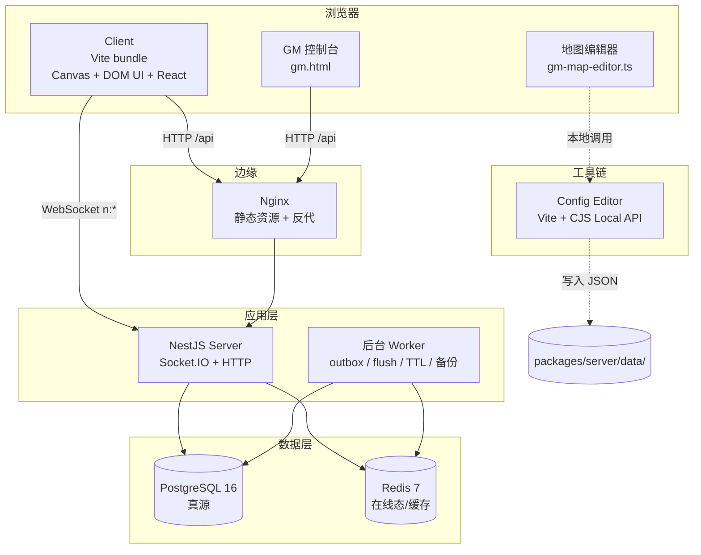
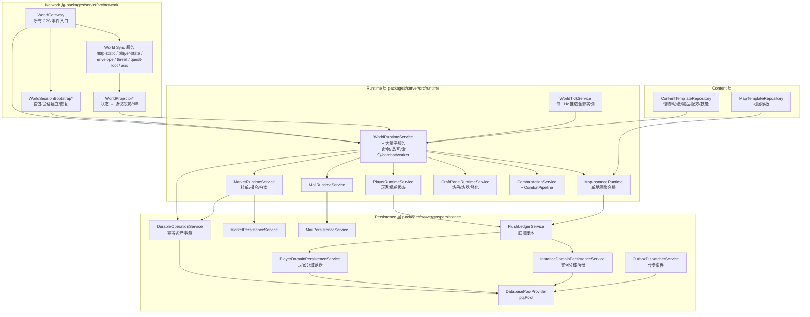
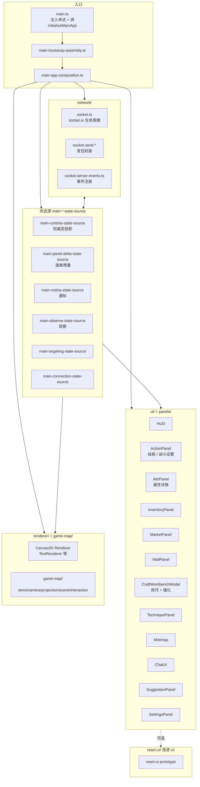
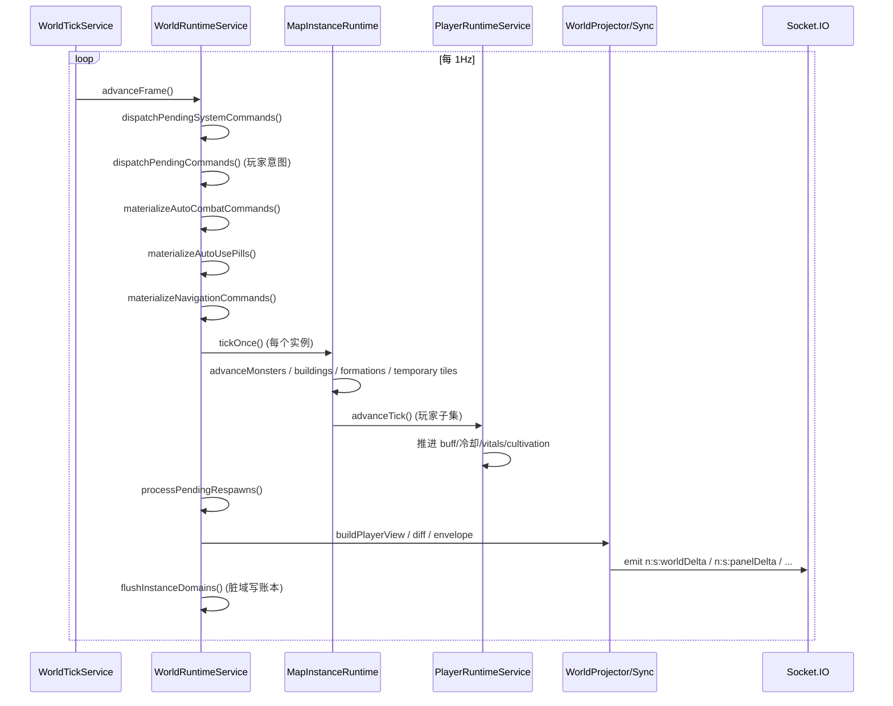
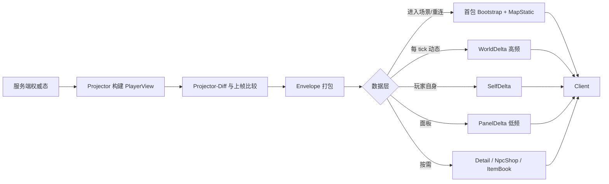
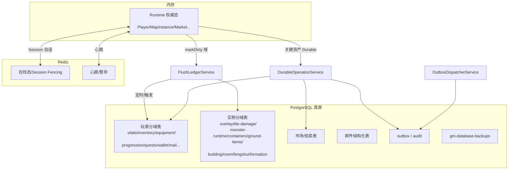
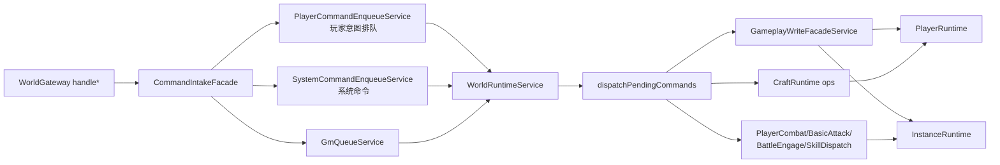

# Architecture

本文件描述道劫余生的系统架构、分层边界和核心设计模式。与 `docs/architecture/` 下的 ADR 互补：ADR 解释"为什么这样决策"，本文件给出"整体系统看起来是什么样、代码落在哪里"。

## 顶层部署拓扑

## 逻辑分层

### 服务端

### 客户端

## Tick 循环（服务端权威）

ADR：`docs/architecture/0002-tick-model.md`。

## 网络分层同步

参考：`docs/architecture/0003-network-sync-layers.md`、`packages/server/src/network/world-projector*`。

## 持久化分层

## 核心设计模式

| 子系统 | 模式 | 代码坐标 |
|--------|------|----------|
| 战斗结算 | Stage Pipeline | `runtime/combat/combat-pipeline.ts` + `combat-pipeline-compose.ts` |
| 战斗事件 | Layered Event Bus（AOI / Notice / Audit / Diagnostic） | `combat-outcome-apply-adapters.ts` + `WorldRuntimeCombatActionService` |
| 世界 Tick | Fixed-timestep Game Loop + per-instance loop | `runtime/tick/world-tick.service.ts` + `world-runtime-instance-tick-orchestration.service.ts` |
| 地图实例 | Aggregate Root（DDD） | `runtime/instance/map-instance.runtime.ts` |
| 玩家运行时 | Rich Domain Model + Domain Service + Dirty Domain Tracking | `runtime/player/player-runtime.service.ts` + `player-progression.service.ts` |
| 持久化 | Repository + Unit of Work + Transactional Outbox | `persistence/*` |
| 强一致资产 | Saga / Durable Operation（幂等 + 审计 + 回滚） | `persistence/durable-operation.service.ts` |
| 网络同步 | CQRS Read Projection + Delta Compression | `network/world-projector*.ts` |
| Socket 网关 | Thin Controller + Intent/Command Queue | `network/world.gateway.ts` + `runtime/world/command/*` |
| 市场 / 邮件 | Domain Service + Pessimistic Locking | `runtime/market/market-runtime.service.ts` |
| 客户端 UI | Manual Retained-mode DOM + Diff Patching | `packages/client/src/ui/` |
| 模块拆分约定 | 纯函数 `.helpers.ts` / `@Injectable()` Service / Facade Service | `docs/architecture/service-split-conventions.md` |

## 命令 / 意图管线（Command Pipeline）

gateway 只做参数归一化 + 排队/调用 facade，不直接写权威态。

## 地图实例生命周期

参考 ADR `docs/architecture/0006-map-instance.md`。核心：

- **模板**（`MapTemplateRepository`）→ 静态地形、NPC、刷怪点、Portal
- **实例**（`MapInstanceRuntime`）→ 运行态：玩家、怪物、掉落、建筑、房间、风水、阵法、临时地块
- **实例目录**（`InstanceCatalogService`）→ 管理实例 lease、迁移、重建
- **持久化分域**（`InstanceDomainPersistenceService`）→ 把运行态的可恢复子集落盘

## 错误与诊断链

- 网络层：`WorldSyncEnvelope` 统一包络，服务端 `S2C.Error` + `S2C.Kick` 回传
- 战斗层：`combat-audit-outbox` + `CombatDiagnostic`（可通过 GM 查询）
- 持久化层：`FlushLedger` 记录失败、`OutboxDispatcherRuntime` 负责重试
- 运维层：`tools/*-report.ts` 输出容量、Lease、恢复时延、数据库退化等报告
- 网关层：`attachPerfObservers` + `attachRateLimitGuard` 做 per-socket 限流与性能采样

## 跨端契约

`@mud/shared` 是唯一真源：

- 事件名常量 `C2S` / `S2C`（`shared/src/protocol.ts`）
- 载荷类型 `C2S_PayloadMap` / `S2C_PayloadMap`（配合 `protocol-*-payload-types.ts`）
- Protobuf schema 与 tick codec（`shared/src/network-protobuf*.ts`）
- 数值与战斗常量（`shared/src/constants/gameplay/`、`constants/network/`）
- 地图文档规范 `shared/src/map-document.ts`（前后端都用同一个 editable map 形状）

协议审计脚本：`pnpm audit:protocol`（`packages/server/src/tools/protocol-audit.ts`），在 CI 中作为门禁保护事件 / 载荷 / protobuf 的一致性。

## 分层约束一览（摘自 AGENTS.md）

- `WorldGateway` 只收集意图，不改权威态
- `runtime/*` 只改权威态；`network/*` 只做投影与发包
- `persistence/*` 不持有运行时状态；被 runtime 调用、被 worker 调用
- `content/*` 只负责模板加载，不触达运行态
- `shared/*` 不能依赖任何运行态和 NestJS 容器
- `tools/*` 是冷路径，运行期进程不加载大部分 smoke / bench 工具

## 相关 ADR（项目已有）

- `docs/architecture/0001-server-authority.md`
- `docs/architecture/0002-tick-model.md`
- `docs/architecture/0003-network-sync-layers.md`
- `docs/architecture/0004-persistence-layers.md`
- `docs/architecture/0005-aoi-system.md`
- `docs/architecture/0006-map-instance.md`
- `docs/architecture/0007-reconnection.md`
- `docs/architecture/ADR-战斗链路统一分层与过渡迁移.md`
- `docs/architecture/service-split-conventions.md`
