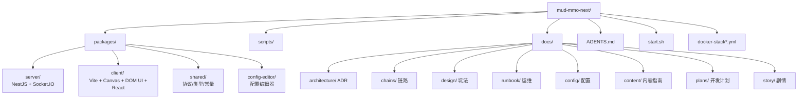
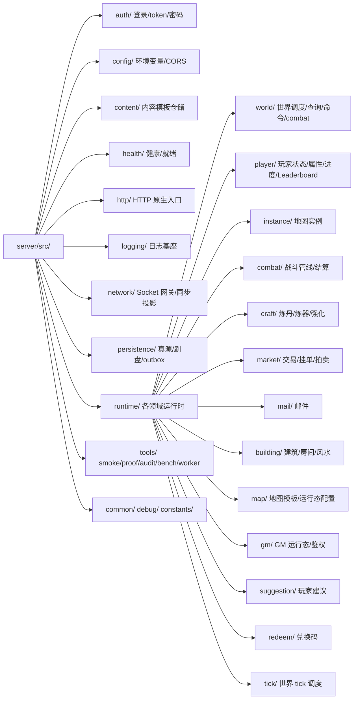
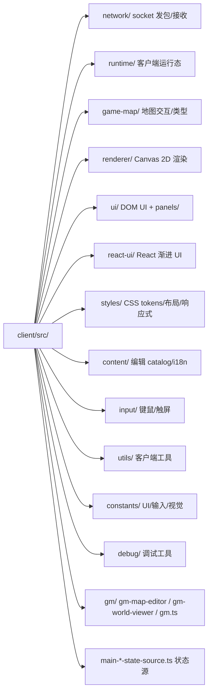

# Codebase Info — 道劫余生（mud-mmo-next）

本文件概述项目规模、技术栈和顶层结构，供 AI agent 在定位代码前建立整体坐标。

## 项目身份

- **项目名**：道劫余生（英文代号 `daojie-yusheng`）
- **类型**：Web MMO MUD，格子地图（类 CDDA 风格）、半即时回合制挂机修仙
- **阶段**：生产主线维护与商业化加固
- **仓库根包名**：`daojie-yusheng`（根 `package.json`）
- **包管理器**：pnpm workspace（`pnpm@10.29.1`）
- **Node 要求**：`>=18`

## 规模与语言分布

- 主要语言：**TypeScript**（服务端、客户端、共享层、配置编辑器）
- 次要：**JavaScript / CJS**（根 `scripts/`、`packages/config-editor/local-api.cjs`、少量 worker/compat 文件）
- Shell：`start.sh`、`docker-build-tencent.sh` 等本地 / 部署脚本
- CSS：`packages/client/src/styles/`
- SQL schema 通过 TypeScript persistence service 的 `ensure*Table` 代码生成，没有独立 `.sql` 源文件

代码集中在 `packages/*` 四个主包，`scripts/` 存放跨包构建 / 校验 / 同步脚本，`docs/` 存放设计、架构、链路、运维和计划文档。

## 顶层目录结构



## 工作区包

| 包 | 路径 | 角色 | 构建工具 |
|----|------|------|----------|
| `@mud/server` | `packages/server` | 服务端运行时、网络、持久化、验证脚本 | `tsc` + smoke suite |
| `@mud/client` | `packages/client` | 浏览器客户端（DOM UI 为主，React 渐进） | `vite` |
| `@mud/shared` | `packages/shared` | 前后端协议 / 类型 / 常量真源 | `tsc` |
| `@mud/config-editor` | `packages/config-editor` | 配置编辑器（本地 API + 前端） | `vite` + Node CJS API |

`@mud/shared` 为其他三个包的工作区依赖（`workspace:*` / `link:../shared`），任何协议或共享类型改动都必须先构建它。

## 技术栈

```mermaid
graph LR
  subgraph Client
    C1[Vite 5]
    C2[TypeScript 5]
    C3[Canvas 2D]
    C4[DOM UI 主线]
    C5[React 19 <br/> react-ui 渐进原型]
    C6[socket.io-client 4]
  end

  subgraph Server
    S1[NestJS 10]
    S2[Socket.IO 4]
    S3[@nestjs/platform-express]
    S4[pg 8 <br/> PostgreSQL driver]
    S5[bcryptjs]
    S6[reflect-metadata + rxjs]
    S7[TypeScript 5]
  end

  subgraph Shared
    Sh1[TypeScript 5]
    Sh2[protobufjs 7]
  end

  subgraph Infra
    I1[(PostgreSQL 16)]
    I2[(Redis 7 <br/> 在线态/缓存)]
    I3[Docker Swarm <br/> 腾讯云 CCR / GHCR]
  end

  C6 <-->|WebSocket| S2
  S4 --> I1
  S1 -.-> I2
  Sh1 --> C2
  Sh1 --> S7
  Sh2 --> Sh1
```

Redis 的客户端代码没有显式列在 `dependencies`（运行期通过环境变量注入 URL 并按需引导），但 `docs/config/server-env.md`、`docs-stack` 文件、以及 AGENTS.md 都以 Redis 为在线态真源。

## 顶层入口

| 入口 | 路径 | 作用 |
|------|------|------|
| 服务端启动 | `packages/server/src/main.ts` → `bootstrap()` | 创建 NestJS 应用，配置 CORS / 安全头，监听 `SERVER_PORT` |
| 服务端根模块 | `packages/server/src/app.module.ts` → `AppModule` | 扁平注册全部 controller / gateway / runtime / persistence provider |
| Socket 网关 | `packages/server/src/network/world.gateway.ts` → `WorldGateway` | 唯一 Socket.IO 入口，所有 C2S 事件聚合于此 |
| HTTP 注册表 | `packages/server/src/http/native-http.registry.ts` | 导出所有 native HTTP controller（健康、GM、数据库等） |
| 客户端启动 | `packages/client/src/main.ts` | 加载样式，调 `initializeMainApp()` 装配运行时 |
| GM 客户端 | `packages/client/src/gm.ts` + `gm.html` | GM 控制台（单独 HTML） |
| 地图编辑器 | `packages/client/src/gm-map-editor.ts` | 内嵌地图编辑器 |
| 世界查看器 | `packages/client/src/gm-world-viewer.ts` | GM 世界实时查看 |
| 配置编辑器前端 | `packages/config-editor/src/main.ts` | 内容配置编辑 UI |
| 配置编辑器 API | `packages/config-editor/local-api.cjs` | 本地 Node CJS API，与编辑器前端协作 |
| 协议 barrel | `packages/shared/src/protocol.ts` + `protocol-*.ts` | `C2S` / `S2C` 事件常量与 PayloadMap |
| Shared 统一出口 | `packages/shared/src/index.ts` | 其他包唯一的类型 / 常量 / 协议出口 |
| 部署（本地） | `start.sh` | 启动本地 Docker 基础设施 + server + client 开发态 |
| 部署（生产） | `docker-stack.yml` / `docker-stack.tencent.yml` | Docker Swarm 生产 stack |

## 运行时权威口径

- **服务端是唯一权威**：客户端只提交意图和显示投影，不裁定移动、战斗、资产。
- **地图 tick 1Hz，每图独立**：世界 tick 周期性推进，每张地图 / 实例一个 tick 循环。
- **玩家意图在 tick 内收集统一执行**；同类可覆盖意图取最后一次（例如寻路目标）。
- **持久化真源是 PostgreSQL**；Redis 只做在线态、缓存和短期索引；内存只做运行时权威态。
- **协议真源是 `@mud/shared`**：C2S/S2C 事件名常量、PayloadMap、protobuf schema 全部在此。
- **配置真源是 `packages/config-editor`** → `packages/server/data/`：编辑器草稿、发布版本、运行时配置需要明确生命周期边界。

## 二级目录分布（packages/server/src）



## 二级目录分布（packages/client/src）



## 数据资源位置

- 服务端内容源：`packages/server/data/`
  - `data/content/monsters/`、`items/`、`techniques/`、`alchemy/`、`forging/`、`quests/` 等
  - `data/maps/` 地图模板 JSON
- 客户端本地内容：`packages/client/src/content/`（编辑器 catalog、i18n、本地模板）
- 运行时持久化目录（本地开发）：`packages/.runtime/`（含 gm-database 备份等，开发 gitignore）

## 相关文档（项目已有）

项目本身文档非常充分，`.agents/summary/` 下的内容不复制，而是建立索引和补充结构化视图：

- `docs/README.md` — 文档中心
- `docs/architecture/INDEX.md` — ADR 与架构模式
- `docs/chains/INDEX.md` — 链路文档
- `docs/design/INDEX.md` — 玩法设计
- `docs/runbook/INDEX.md` — 运维手册
- `docs/plans/INDEX.md` — 开发计划
- `AGENTS.md`（仓库根） — Agent 执行规范（22 章）
