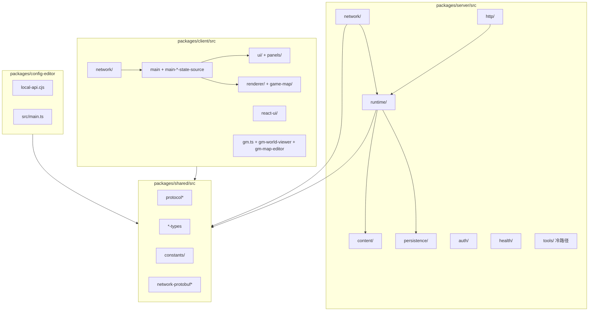
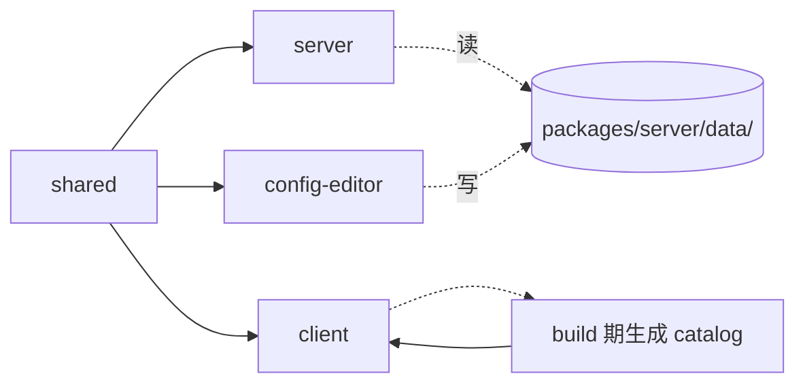

# Components

本文件列出主要组件、职责边界和代码坐标。粒度以"agent 能定位到文件"为准，不逐一展开内部方法。

## 组件分域图

## 服务端 — Network（Socket + 投影）

`packages/server/src/network/`

| 组件 | 职责 |
|------|------|
| `WorldGateway` | 唯一 Socket.IO 网关，聚合所有 `n:c:*` C2S 事件 handler、鉴权接入、限流观察器、心跳、断线清理 |
| `world-gateway-*.helper.ts` | 按领域拆分的 handler 辅助（action / inventory / craft / mail / market / npc / building / movement / session-state / gm / suggestion / presence / guard / client-emit） |
| `world-session-bootstrap*.service.ts` | 首包 / 会话绑定 / 快照恢复 / 契约校验 / finalize / post-emit 链路（多服务拆分） |
| `world-session.service.ts` / `world-session-reaper.service.ts` / `world-session-recovery-queue.service.ts` | 会话生命周期、过期回收、恢复队列 |
| `world-player-auth.service.ts` / `world-player-token*.ts` / `world-player-source.service.ts` | 玩家身份解析、token 编解码、身份来源选择 |
| `world-projector.service.ts` + `world-projector.helpers.ts` + `projector-types.ts` / `projector-diff.ts` / `projector-compare.ts` / `projector-clone.ts` | 把权威态投影成 PlayerView，做帧间 diff |
| `world-sync.service.ts` + `world-sync-*` 系列 | 按域拆分的同步：`map-snapshot` / `map-static-aux` / `player-state` / `aux-state` / `minimap` / `threat` / `quest-loot` / `envelope` / `protocol` |
| `world-gm-socket.service.ts` / `world-gm-auth.service.ts` | Socket 侧 GM 命令转发与权限 |
| `world-auth.registry.ts` | 鉴权 provider 集合 |
| `sync-slot.ts` / `gateway-result.types.ts` | 同步槽位与网关返回类型 |

## 服务端 — Runtime（权威运行时）

`packages/server/src/runtime/`

### world/ — 世界总控与读写分离

| 组件 | 职责 |
|------|------|
| `world-runtime.service.ts` | 世界聚合 facade：分派意图、tick 推进、实例管理、玩家视图构建 |
| `world-runtime.controller.ts` | 运行时 HTTP 路由（`/world/*`），对 GM/工具提供读写入口 |
| `world-runtime-frame.service.ts` + `world-runtime-tick-dispatch.service.ts` + `world-runtime-instance-tick-orchestration.service.ts` | Tick 帧编排 |
| `world-runtime-state-facade.service.ts` | 薄状态门面（AGENTS.md 所指的 Facade 模式） |
| `world-runtime-gameplay-write-facade.service.ts` | 所有写意图统一入口 |
| `query/*` | 读取专用服务（npc-shop / quest / detail / context-action / player-view / instance / summary / npc-quest-interaction），组成 Read Facade |
| `command/*` | 意图管线：`command-intake-facade` / `player-command` / `player-command-enqueue` / `system-command` / `system-command-enqueue` / `gm-queue` / `pending-command` / `monster-system-command` / `action-execution` |
| `combat/*` | 战斗：`combat-action` / `basic-attack` / `battle-engage` / `auto-combat` / `player-skill-dispatch` / `monster-action-apply` / `player-combat` / `player-combat-outcome` / `combat-command` / `combat-effects` |
| `world-runtime-navigation.service.ts` | 玩家寻路、跨图路由 |
| `world-runtime-lifecycle.service.ts` | 实例启动 / 恢复 / 迁移 / 冻结 |
| `world-runtime-player-session.service.ts` | 玩家会话接入与注销 |
| `world-runtime-movement.service.ts` | 移动意图消化 |
| `world-runtime-respawn.service.ts` | 死亡重生调度 |
| `world-runtime-transfer.service.ts` | 跨实例传送 |
| `world-runtime-world-access.service.ts` / `world-runtime-instance-state.service.ts` / `world-runtime-player-location.service.ts` | 访问器 |
| `world-runtime-metrics.service.ts` / `world-runtime-tick-progress.service.ts` | 观测 |
| `world-runtime-equipment.service.ts` / `world-runtime-cultivation.service.ts` / `world-runtime-progression.service.ts` / `world-runtime-use-item.service.ts` | 装备、修炼、进度、使用物品 |
| `world-runtime-alchemy.service.ts` / `world-runtime-enhancement.service.ts` + `world-runtime-craft-tick.service.ts` / `world-runtime-craft-mutation.service.ts` / `world-runtime-craft-interrupt.service.ts` | 炼丹 / 强化 / 通用制作管线 |
| `world-runtime-npc-shop.service.ts` / `world-runtime-npc-quest-write.service.ts` / `world-runtime-npc-access.service.ts` | NPC 商店、任务写、访问 |
| `world-runtime-loot-container.service.ts` | 掉落容器（药草、宝箱） |
| `world-runtime-item-ground.service.ts` | 地面物品 |
| `world-runtime-building.service.ts` + `world-runtime-formation.service.ts` + `world-runtime-sect.service.ts` + `world-runtime-tongtian-tower.service.ts` | 建筑 / 阵法 / 宗门 / 通天塔 |
| `world-runtime-redeem-code.service.ts` | 兑换码 |
| `world-runtime-quest-state.service.ts` + `world-runtime-quest-runtime-facade.service.ts` | 任务状态管理 |
| `world-runtime-persistence-state.service.ts` | 脏域/Lease/持久化状态检查 |
| `world-runtime-instance-lease.helpers.ts` | 实例 lease 判定（纯函数） |
| `worker/*` | 后台 worker（asset-audit-log-retention / mail-soft-delete-purge / player-anchor-checkpoint / player-state / instance-resource / instance-ground-item / instance-container / instance-tile-damage / instance-overlay / instance-monster-runtime / checkpoint-compaction） |
| `runtime-http-access.guard.ts` | 运行时 HTTP 鉴权守卫 |

### player/ — 玩家权威态

| 组件 | 职责 |
|------|------|
| `player-runtime.service.ts` | 玩家运行时总服务：状态、属性、buff、背包、装备、技能、offline gain、统计、脏域跟踪、session fencing |
| `player-progression.service.ts` | 修为、境界、天道、破境、根骨、丹药作用 |
| `player-attributes.service.ts` | 属性结算 / QiProjection / 装备加成 / 天赋投影 |
| `leaderboard-runtime.service.ts` | 排行榜与玩家位置查询 |
| `player-combat-config.helpers.ts` / `player-buff-projection.helpers.ts` | 战斗配置与 buff 投影纯函数 |
| `runtime-player.entity.ts` / `player-runtime.state.ts` / `player-runtime-sub-services.types.ts` | 运行时玩家实体与子服务依赖契约 |

### instance/ — 地图实例聚合根

| 组件 | 职责 |
|------|------|
| `map-instance.runtime.ts` | 单地图聚合根：玩家、怪物、掉落、建筑、房间、风水、阵法、地块资源、AOI、路径、tick |
| `map-instance-monster-advancer.ts` | 怪物每 tick AI 推进（移动、视野、施法、重生） |
| `map-instance-building.delegate.ts` | 建筑子域代理 |
| `map-instance-persistence-projector.ts` | 运行态→持久化投影 |
| `fov.helpers.ts` | 视野 / 照明纯函数 |

### combat/ — 战斗结算

| 组件 | 职责 |
|------|------|
| `combat-pipeline.ts` + `combat-pipeline-compose.ts` | 分阶段战斗管线组合 |
| `combat-outcome-apply-adapters.ts` | 结果应用适配器（伤害/buff/治疗等） |
| `combat-resolution.helpers.ts` | 命中 / 闪避 / 暴击 / 免疫纯函数 |
| `player-combat.service.ts` | 玩家战斗服务（受击、反击、自动战斗锁定） |
| `combat-event-query.ts` | 战斗事件查询（诊断） |
| `combat-runtime-event-ring.helpers.ts` | 环形事件缓冲 |
| `pending-combat-cast.helpers.ts` + `pending-combat-cast-recovery.helpers.ts` | 吟唱 / 施法前摇 / Redis 恢复 |
| `monster-combat-exp-equivalent.helper.ts` | 怪物战斗经验折算 |

### 其他领域 runtime

| 目录 | 主要组件 | 说明 |
|------|----------|------|
| `runtime/craft/` | `craft-panel-runtime.service.ts` + `craft-panel-alchemy-query.service.ts` + `craft-panel-enhancement-query.service.ts` + `pipeline/` + helpers | 炼丹、炼器、强化、队列、技艺活动 |
| `runtime/market/` | `market-runtime.service.ts` | 挂单、撮合、拍卖、仓储、历史 |
| `runtime/mail/` | `mail-runtime.service.ts` | 邮件发送、读取、附件领取、软删 |
| `runtime/redeem/` | `redeem-code-runtime.service.ts` | 兑换码组 / 批发 / 消耗 |
| `runtime/suggestion/` | `suggestion-runtime.service.ts` | 玩家建议与 GM 回复 |
| `runtime/map/` | `map-template.repository.ts` + `runtime-map-config.service.ts` + `runtime-tile-plane.ts` + `runtime-tile-expansion.ts` | 地图模板加载、运行时地图配置、稀疏 tile 面 |
| `runtime/gm/` | `runtime-gm-auth.service.ts` + `runtime-gm-state.service.ts` | GM 鉴权与世界观察状态 |
| `runtime/building/` | `fengshui-calculator.service.ts` + `room-detection.service.ts` + `building-content.repository.ts` + `building-default-content.ts` + `building-topology-index.service.ts` | 建筑拓扑、房间识别、风水计算、建筑模板 |
| `runtime/tick/` | `world-tick.service.ts` | 全局 tick 调度（根据配置推进 world runtime） |

## 服务端 — Persistence

`packages/server/src/persistence/`

| 组件 | 职责 |
|------|------|
| `database-pool.provider.ts` | `pg.Pool` provider |
| `player-domain-persistence.service.ts` | 玩家分域表（身份 / 位置 / vitals / 进度 / 身训 / 装备 / 背包 / 钱包 / 任务 / buff / 功法 / 地图解锁 / 市场仓储 / 强化记录 / 活跃 Job / 炼丹预设 / 自动战斗 / 自动吃丹 / 日志 / offline-gain / 统计） |
| `instance-domain-persistence.service.ts` | 实例分域表（overlay chunk / tile-damage / tile-resource / runtime-tile / temporary-tile / ground-item / container / monster-runtime / event-state / building / building-cell / room / room-cell / fengshui / recovery-watermark / checkpoint） |
| `durable-operation.service.ts` | 强一致资产变更（幂等 + 审计 + 回滚）：NPC 商店、市场买卖现货 / 取消订单 / 领取、背包授予、钱包变更、任务奖励、装备更换、Active Job（炼丹/强化）启动/完成/取消 |
| `player-persistence.service.ts` + `player-persistence-flush.service.ts` + `player-flush-ledger.service.ts` + `player-counters-persistence.service.ts` | 旧版玩家快照 + 刷盘与账本 |
| `player-identity-persistence.service.ts` | 玩家账号身份与密码 |
| `player-session-route.service.ts` | 玩家会话路由 / 多节点接管 |
| `map-persistence.service.ts` + `map-persistence-flush.service.ts` | 地图实例目录与刷盘 |
| `instance-catalog.service.ts` | 实例 lease / catalog / 可迁移判定 |
| `market-persistence.service.ts` / `mail-persistence.service.ts` / `suggestion-persistence.service.ts` / `redeem-code-persistence.service.ts` / `gm-map-config-persistence.service.ts` / `tongtian-tower-persistence.service.ts` | 各域专用持久化 |
| `outbox-dispatcher.service.ts` + `outbox-dispatcher-runtime.service.ts` + `outbox-event-consumer-registry.service.ts` + `persistent-document-table.ts` | Outbox 事件发布与消费注册 |
| `combat-audit-outbox.service.ts` | 战斗审计 outbox |
| `flush-ledger.service.ts` + `flush-wakeup.service.ts` | 脏域账本和唤醒调度 |
| `node-registry.service.ts` + `node-registry-runtime.service.ts` | 多节点注册 |
| `schema-bigint-migration.ts` | 历史 int→bigint 迁移 |
| `inventory-item-persistence.ts` | 背包条目结构 |

## 服务端 — HTTP / Auth / Content / Health

| 组件 | 路径 | 职责 |
|------|------|------|
| `http/native-http.registry.ts` | 注册所有 native controller |
| `http/native/` | GM controller（`native-gm.controller.ts` + `native-gm-admin.service.ts` + `native-gm-player.service.ts`）、账号、数据库、建议、邮件、兑换码等 HTTP 入口 |
| `auth/player-token-verify.ts` / `password-hash.ts` / `account-validation.ts` | 玩家 token 验证、bcrypt、账号格式 |
| `content/content-template.repository.ts` | 所有内容模板（怪物、物品、技能、功法、配方、掉落池、怪物运行时状态）加载与归一化 |
| `health.controller.ts` + `health/health-readiness*.ts` + `server-readiness-dependencies.service.ts` | `/health` 与 readiness（DB / Redis 可用性） |
| `logging/console-log-buffer.ts` + `date-console-logger.ts` | 日志基座 |
| `config/env-alias.ts` / `load-local-runtime-env.ts` / `server-cors.ts` | 环境变量别名、本地 env 加载、CORS 策略 |
| `common/project-path.ts` | 项目根路径解析 |
| `debug/movement-debug.ts` | 调试辅助 |

## 服务端 — Tools（冷路径）

`packages/server/src/tools/`

- **Smoke**：`*-smoke.ts`（`auth-bootstrap-smoke.ts`、`gm-smoke.ts`、`gm-database-smoke.ts`、`combat-smoke.ts`、`protocol-audit.ts`、`persistence-smoke.ts`、`durable-operation-smoke.ts` 等 100+ 文件）
- **Suite**：`run-stable-smoke-suite.ts` + `smoke-suite.ts` + `stable-dist.ts` 组合执行
- **Proof**：`prove-*.ts`、`check-production-boundaries.ts`、`check-content-*-consistency.ts`
- **Audit**：`audit/production-boundary-audit.ts`、`protocol-audit.ts` / `protocol-audit-lib.ts`、`persistence-retirement-audit.ts`、`map-dynamic-persistence-audit.ts`
- **Bench**：`bench-combat.ts`、`bench-sync.ts`、`bench-tick.ts`、`bench-first-package.ts`、`bench-building-room-fengshui.ts`、`bench-hot-paths.ts`、`bench-combat-regression.ts`
- **Worker**：`outbox-dispatcher-worker.ts`、`player-state-flush-worker.ts`、`instance-*-flush-worker.ts`、`mail-*-purge-worker.ts`、`checkpoint-compaction-worker.ts`、`database-backup-worker.ts`、`asset-audit-log-retention-worker.ts`
- **Report**：`*-report.ts`（capacity-planning、recovery-latency、session-fencing、worker-throughput、transfer-pressure、archive-vacuum-window、mail-counter-consistency、partition-*、redis-ha-planning 等）
- **Dev**：`dev-hot.ts`（热启动）、`run-compiled-tool.ts`（编译后统一入口）
- **Convert / Migrate**：`convert-main-dump-to-current-db.ts`、`import-legacy-persistence-once.ts`、`migrate-internal-techniques.ts`、`deploy-database-preflight.ts`

这些文件运行期不加载；`check-production-boundaries.ts` 会守护生产代码不引入工具路径。

## Shared

`packages/shared/src/`

| 组 | 文件 | 内容 |
|---|------|------|
| Protocol barrel | `protocol.ts` | `C2S`/`S2C` 事件常量与 PayloadMap |
| Protocol domain | `protocol-core.ts` / `protocol-combat.ts` / `protocol-craft.ts` / `protocol-social.ts` / `protocol-market.ts` | 域内接口定义 |
| Payload types | `protocol-request-payload-types.ts` / `protocol-response-payload-types.ts` / `protocol-envelope-types.ts` | 明细载荷 |
| Protobuf | `network-protobuf.ts` / `-schema.ts` / `-wire-helpers.ts` / `-tick-codecs.ts` / `-update-codecs.ts` / `-payload-codecs.ts` | Tick / Delta 二进制编解码 |
| 数值 / 属性 | `numeric.ts` / `attribute-types.ts` / `attr-detail-types.ts` / `value.ts` / `display-number.ts` | 基础数值 |
| 玩法 | `technique.ts` / `technique-activity-*` / `alchemy.ts` / `enhancement*` / `craft-*` / `cultivation-types.ts` / `monster.ts` / `combat*` / `targeting.ts` / `quest-types.ts` / `skill-types.ts` / `automation-types.ts` / `formation-types.ts` / `sect-types.ts` / `mail*.ts` / `market-*.ts` / `building-types.ts` / `fengshui-types.ts` / `build-material.ts` / `aura.ts` / `qi.ts` / `age.ts` | 玩法共享类型 |
| 地图 | `map-document.ts` / `map-layer-types.ts` / `map-groups.ts` / `terrain.ts` / `pathfinding.ts` / `geometry.ts` / `direction.ts` | 地图契约 |
| 同步 | `world-core-types.ts` / `world-view-types.ts` / `world-patch-types.ts` / `panel-update-types.ts` / `synced-panel-types.ts` / `service-sync-types.ts` / `session-sync-types.ts` / `loot-view-types.ts` / `observation-types.ts` / `progression-view-types.ts` / `entity-detail-types.ts` / `detail-view-types.ts` / `notice-types.ts` / `offline-gain-types.ts` / `leaderboard-types.ts` | 视图与同步 |
| API | `api-contracts.ts` | HTTP API 契约（~3000 行） |
| 工具 | `structured.ts` / `grapheme.ts` / `role-name.ts` / `name-visibility.ts` / `path-codec.ts` / `target-ref.ts` | 杂项工具 |
| 常量 | `constants/gameplay/` / `constants/network/` / `constants/ui/` / `constants/visuals/` | 常量集 |
| 生成 | `tutorial-mechanics.generated.ts` | 由 `scripts/sync-tutorial-mechanics.mjs` 生成 |

## Client

`packages/client/src/`

### 状态源（`main-*-state-source.ts`）

每个状态源封装一类数据的订阅 / 缓存 / 通知：`runtime` / `panel-delta` / `runtime-delta` / `notice` / `observe` / `targeting` / `breakthrough` / `attr-detail` / `settings` / `navigation` / `world-summary` / `connection` / `market` / `mail` / `quest` / `suggestion` / `technique` / `detail` / `detail-hydration` / `action` / `root-runtime` / `runtime-monitor` / `reset` / `inventory` / `formation-preview` / `building-fengshui` / `ui`。

### Network

| 文件 | 职责 |
|------|------|
| `network/socket.ts` | socket.io 生命周期 |
| `network/socket-event-registry.ts` + `socket-server-events.ts` | 服务端事件监听注册 |
| `network/socket-lifecycle-controller.ts` | 连接生命周期控制 |
| `network/socket-send-runtime.ts` / `panel.ts` / `building.ts` / `admin.ts` / `social-economy.ts` | 发包封装（按域拆分） |
| `network/socket-send-types.ts` | 发送契约 |

### Renderer / Map

- `renderer/text.ts`：超大综合 Canvas 渲染器（实体、路径、警告区、攻击轨迹、飘字、阵法范围、风水 overlay、目标指示）
- `renderer/tile-sprite-cache.ts` / `text-measure-cache.ts` / `camera.ts` / `types.ts`
- `game-map/`：`store/` / `scene/` / `camera/` / `interaction/` / `projection/` / `viewport/` / `minimap/` / `renderer/` / `runtime/` / `types.ts`

### UI（DOM）

`packages/client/src/ui/`

- **壳**：`hud.ts`、`side-panel.ts`、`ui-modal-frame.ts`、`confirm-modal-host.ts`、`detail-modal-host.ts`、`external-link-guard.ts`、`login.ts`、`i18n.ts`
- **主面板（panels/）**：`action-panel.ts` + `action-panel-skill-management.ts` + `action-panel-combat-settings.ts`、`attr-panel.ts`、`inventory-panel.ts`、`market-panel.ts`、`technique-panel.ts`、`settings-panel.ts`
- **其他面板**：`mail-panel.ts`、`suggestion-panel.ts`、`npc-shop-modal.ts`、`npc-quest-modal.ts`、`entity-detail-modal.ts`、`craft-workbench-modal.ts` + `craft-enhancement-view.ts` + `craft-alchemy-view.ts` + `craft-queue-view.ts`、`heaven-gate-modal.ts`、`tutorial-panel.ts`、`offline-gain-modal.ts` + `offline-gain-render.ts`、`world-migration-modal.ts`、`changelog-panel.ts` + `changelog-data.ts`、`debug-panel.ts`
- **Tooltip / 组件**：`equipment-tooltip.ts`、`skill-tooltip.ts`、`floating-tooltip.ts`、`item-inline-tooltip.ts`、`item-display.ts`、`stat-preview.ts`、`technique-bonus-summary.ts`、`minimap.ts`、`chat.ts` + `chat-storage.ts`、`ui-primitives.ts`、`ui-style-config.ts`、`selection-preserver.ts`、`responsive-viewport.ts`、`performance-config.ts`、`dom-patch.ts`、`patchable-panel.ts`、`auth-api.ts`、`account-rules.ts`

### React UI（渐进）

`packages/client/src/react-ui/`：`prototype/`、`bridge/`、`stores/`、`hooks/`、`primitives/`、`overlays/`、`styles/`、`app/` + `REACT_UI_REFACTOR_PLAN.md`。不得绕过现有 store 与网络边界。

### GM / 编辑器客户端

- `gm.ts`（~8000 行）+ `gm.html`：GM 控制台主页面
- `gm-world-viewer.ts`：世界实时查看
- `gm-map-editor.ts` + `gm-map-editor-helpers.ts`：地图编辑器
- `gm/helpers/`：内部工具

## Config Editor

`packages/config-editor/`

| 组件 | 职责 |
|------|------|
| `local-api.cjs` | Node CJS 本地 API：读写 `packages/server/data/`，重启服务，监听内容变化，校验怪物 / 功法 / 物品模板 |
| `src/main.ts` | 编辑器前端：文件列表、怪物模板、功法模板、服务状态、i18n |
| `index.html` | 编辑器页面 |
| `start.sh` | 启动脚本 |

## 跨包依赖摘要

Shared 必须先构建；客户端构建前通过 `prebuild` 调用 `scripts/generate-editor-catalog.mjs` / `generate-item-sources.mjs` / `generate-building-catalog.mjs` / `generate-i18n.mjs` 生成 catalog。
