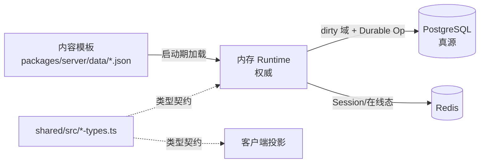

# Data Models

数据结构和真源位置。具体字段以代码为准，本文件给出定位。

## 真源层级

## 共享类型清单（`packages/shared/src/`）

| 域 | 文件 | 说明 |
|---|------|------|
| 玩家运行时 | `player-runtime-types.ts` | 玩家视图结构 |
| 玩家进度 | `progression-view-types.ts` / `cultivation-types.ts` | 境界、修为、根骨展示 |
| 属性 | `attribute-types.ts` / `attr-detail-types.ts` / `numeric.ts` / `value.ts` | 六维、加成、倍率 |
| 物品 | `item-runtime-types.ts` / `item-stack.ts` | 运行时物品 / 堆叠 |
| 功法 | `technique.ts` / `technique-activity-*` | 功法定义、层数、技艺活动（炼丹/强化/炼器） |
| 制作 | `alchemy.ts` / `enhancement.ts` / `enhancement-cost.ts` / `crafting-types.ts` / `craft-duration.ts` / `craft-skill.ts` / `craft-success.ts` | 炼丹配方、强化公式 |
| 战斗 | `combat.ts` / `combat-event-types.ts` / `combat-relation.ts` / `skill-types.ts` / `targeting.ts` / `target-ref.ts` / `action-combat-types.ts` | 战斗事件、敌我判定、技能、目标 |
| 怪物 | `monster.ts` | 怪物模板、运行时状态、掉落池 |
| 任务 | `quest-types.ts` | 任务模板与进度 |
| 市场 | `market-types.ts` / `market-price.ts` | 挂单、撮合、拍卖 |
| 邮件 | `mail.ts` / `mail-types.ts` | 邮箱、邮件、附件 |
| 建筑 / 风水 | `building-types.ts` / `fengshui-types.ts` / `build-material.ts` | 建筑实例、风水参数、材料 |
| 阵法 | `formation-types.ts` | 阵法模板、实例、生命周期 |
| 宗门 | `sect-types.ts` | 宗门模板与成员 |
| 地图 | `map-document.ts` / `map-layer-types.ts` / `map-groups.ts` / `terrain.ts` / `pathfinding.ts` / `geometry.ts` / `direction.ts` | 编辑态 / 运行态地图、地块、寻路 |
| 灵气 / 气机 | `qi.ts` / `aura.ts` | Qi Projection、灵气 |
| 世界 / 视图 | `world-core-types.ts` / `world-view-types.ts` / `world-patch-types.ts` | 世界首包 / 投影 / 补丁 |
| 面板 | `panel-update-types.ts` / `synced-panel-types.ts` | 面板增量 |
| 通知 | `notice-types.ts` | 结构化通知（key + vars + pills + badges，见 AGENTS.md §22） |
| Offline Gain | `offline-gain-types.ts` | 离线收益 |
| 排行 | `leaderboard-types.ts` | 榜单 |
| 观察 / 详情 | `observation-types.ts` / `detail-view-types.ts` / `entity-detail-types.ts` / `loot-view-types.ts` | GM / 玩家观察、详情 |
| 自动化 | `automation-types.ts` | 自动战斗、自动用丹、目标规则 |
| 会话 / 服务同步 | `session-sync-types.ts` / `service-sync-types.ts` | 会话与服务契约 |
| GM | `gm-runtime-types.ts` | GM 观察载荷 |
| 年龄 / 身份 | `age.ts` / `role-name.ts` / `name-visibility.ts` / `grapheme.ts` | 基础工具类型 |
| 协议载荷 | `protocol-request-payload-types.ts` / `protocol-response-payload-types.ts` / `protocol-envelope-types.ts` | Socket 载荷 |
| 客户端请求 | `client-core-request-types.ts` / `client-service-request-types.ts` / `client-social-admin-request-types.ts` | 客户端 API 请求 |
| API 契约 | `api-contracts.ts` | HTTP 响应 |
| Protobuf | `network-protobuf*.ts` | 二进制编解码 schema |
| 结构化工具 | `structured.ts` / `display-number.ts` / `path-codec.ts` | 辅助 |
| 常量 | `constants/gameplay/*` / `constants/network/*` / `constants/ui/*` / `constants/visuals/*` | 数值常量 |
| 教学 | `tutorial-mechanics.generated.ts` | 生成的教学机制 |

所有类型从 `@mud/shared` 入口统一导出（见 `shared/src/index.ts`）。

## PostgreSQL 表清单

表结构由 persistence service 的 `ensure*Table()` 声明（不存在 `.sql` 文件）。主要域：

### 玩家分域（`player-domain-persistence.service.ts` 的 `ensurePlayerDomainTables()`）

玩家按域拆分为多个结构化表（具体表名见代码）：

| 域 | Replace API | 内容 |
|---|-------------|------|
| 身份 | `player-identity-persistence.service.ts` 管理 | 账号、密码哈希、角色名、禁封 |
| 位置 / 世界锚 | `replacePlayerPositionCheckpoint`、`replacePlayerWorldAnchor` | 实例 ID、坐标、朝向 |
| Vitals | `replacePlayerVitals` | HP、Qi、baseline bonus |
| Progression Core | `replacePlayerProgressionCore` | 根基、战斗经验、境界 stage、天道 |
| 属性状态 | `replacePlayerAttrState` | 基础六维、runtime bonus 序列化 |
| 身训 | `replacePlayerBodyTrainingState` | 等级、经验、目标 |
| 装备 | `replacePlayerEquipmentSlots` | 装备槽位 |
| 背包 | `replacePlayerInventoryItems` | 背包条目 |
| 钱包 | `replacePlayerWalletRows` | 钱币 / 特殊货币余额 |
| 功法 | `replacePlayerTechniqueStates` | 玩家功法层数、经验、学习状态 |
| 任务进度 | `replacePlayerQuestProgressRows` | Kill / Talk / LearnTechnique 进度 |
| 持久化 buff | `replacePlayerPersistentBuffStates` | 长生/封印等持久 buff |
| 地图解锁 | `replacePlayerMapUnlockRows` / `replacePlayerMapUnlocks` | 已解锁地图 ID |
| 市场仓储 | `replacePlayerMarketStorageItems` | 市场仓库物品 |
| 强化记录 | `replacePlayerEnhancementRecords` | 历史强化统计 |
| Active Job | `replacePlayerActiveJob` | 当前进行中的炼丹/强化 job（幂等 version + status） |
| 炼丹预设 | `replacePlayerAlchemyPresets` | 玩家保存的炼丹配方预设 |
| 自动战斗 | `replacePlayerAutoBattleSkills` | 自动战斗技能序列 |
| 自动吃丹 | `replacePlayerAutoUseItemRules` | 自动用药规则 |
| 战斗偏好 | `replacePlayerCombatPreferences` | 目标模式、规则 |
| 职业状态 | `replacePlayerProfessionStates` | 采集 / 制作等级 |
| 日志 | `replacePlayerLogbookMessages` | 待拉取日志 |
| 世界偏好 | `applyProjectedWorldPreference` | 线路预设等 |
| Offline Gain | `savePlayerOfflineGainReport` / `savePlayerOfflineGainSession` | 离线收益会话与报告 |
| 玩家统计 | `incrementPlayerStatisticDayTotal` / `loadPlayerStatisticDayTotals` | 每日统计累计 |
| 在线状态 | `savePlayerPresence` / `listPlayerPresence` | session fencing、节点归属 |
| 恢复水位 | `upsertRecoveryWatermark` | 恢复检查点 |

### 实例分域（`instance-domain-persistence.service.ts` 的 `ensureInstance*Table()`）

| 表域 | 内容 |
|------|------|
| `tile-cell` / `tile-resource` / `tile-damage` | 地块层状态（runtime tile、资源、损伤） |
| `temporary-tile-state` | 临时地块效果 |
| `overlay-chunk` | 地图 overlay 分块 |
| `ground-item` | 地面掉落 |
| `container-state` / `container-entry` / `container-timer` | 可采集容器（药草 / 宝箱） |
| `monster-runtime-state` | 怪物运行态（位置、HP、lease） |
| `event-state` | 事件状态 |
| `building-state` / `building-cell` | 建筑实例与占位 |
| `building-audit-log` / `building-operation-idempotency` | 建筑操作幂等与审计 |
| `room-state` / `room-cell` | 房间识别结果 |
| `feng-shui-state` | 风水结果 |
| `formation-state` | 阵法状态（`world-runtime-formation.service.ts` 自己 ensure） |
| `recovery-watermark` / `checkpoint` | 恢复检查点 |

### 强一致资产表（`durable-operation.service.ts`）

幂等操作日志、资产变更审计、market/mail/inventory/wallet/equipment mutation 记录。

### 其他域

| 域 | Service | 用途 |
|----|---------|------|
| 邮件 | `mail-persistence.service.ts`（结构化 mail / attachment / counter / recovery-watermark） | 邮箱、软删、过期归档 |
| 市场 | `market-persistence.service.ts` | 挂单、交易历史、拍卖 |
| 建议 | `suggestion-persistence.service.ts` | 玩家建议、投票、回复 |
| 兑换码 | `redeem-code-persistence.service.ts` | 兑换码组、单码、使用记录 |
| GM 地图配置 | `gm-map-config-persistence.service.ts` | GM 编辑器保存的地图配置 |
| 通天塔 | `tongtian-tower-persistence.service.ts` | 通天塔层级状态 |
| GM Admin | `native-gm-admin.service.ts` 内部 ensure | GM 密码、数据库备份元数据、数据库 job state |
| Outbox | `outbox-dispatcher.service.ts` + `combat-audit-outbox.service.ts` | 异步事件分发、战斗审计 |
| 节点注册 | `node-registry.service.ts` | 多节点 lease |

## 内存 Runtime 状态

### 玩家 Runtime

`packages/server/src/runtime/player/`：

- `RuntimePlayerState`（内部）：位置、vitals、cultivation、attr、buff、背包、装备、钱包、技能、自动战斗、离线会话、脏域 set
- 脏域枚举：在 `player-runtime.service.ts` 内部管理，通过 `markPlayerDirtyDomains()` 驱动 `FlushLedger`
- `ListDirtyPlayerDomains()` 是刷盘 worker 的入口

### 地图实例 Runtime

`packages/server/src/runtime/instance/map-instance.runtime.ts`：聚合根，包含：

- `players`、`monsters`、`npcs`、`safeZones`、`landmarks`、`containers`、`groundPiles`、`portals`
- Tile 状态：runtime tile、tile resource、tile damage、temporary tile、aura、overlay
- Building / Room / FengShui / Formation 子域
- Dirty domain / Persistence delta 账本

### 市场 / 邮件 / 建议 / 兑换码 Runtime

单例服务，内部持有缓存 + 持久化服务；写操作走 Durable Operation 或专用锁。

## 协议载荷结构定位

首包与高频：

- `S2C_Bootstrap` / `S2C_MapStatic` / `S2C_MapEnter` — 进入场景
- `S2C_Tick` / `S2C_WorldDelta` / `S2C_SelfDelta` — 高频同步
- `S2C_PanelDelta` — 面板低频增量
- `S2C_Detail` / `S2C_TileDetail` / `S2C_AttrDetail` — 按需详情
- `S2C_LootWindowUpdate` / `S2C_NpcShop` / `S2C_Quests` — 交互态
- `S2C_MailDetail` / `S2C_AlchemyPanel` / `S2C_EnhancementPanel` — 面板详情

结构定义分布在：

- 事件级：`shared/src/protocol-core.ts`、`protocol-combat.ts`、`protocol-craft.ts`、`protocol-social.ts`
- 字段级：`shared/src/protocol-response-payload-types.ts`、`protocol-request-payload-types.ts`
- 视图级：`shared/src/world-view-types.ts`、`world-patch-types.ts`、`panel-update-types.ts`

## 内容模板（JSON 源）

`packages/server/data/`：

- `data/content/monsters/` — 怪物，按地图文件组织
- `data/content/items/` — 物品，按境界/类型分层
- `data/content/techniques/` — 功法与技能
- `data/content/alchemy/` — 炼丹配方
- `data/content/forging/` — 炼器配方
- `data/content/quests/` — 任务
- `data/maps/` — 地图文档（也是编辑器保存目标）

加载 / 归一化入口：`content/content-template.repository.ts`（物品 / 怪物 / 功法 / 技能 / 掉落池 / 怪物基线）、`runtime/map/map-template.repository.ts`（地图模板）、`runtime/building/building-content.repository.ts`（建筑模板）。

## 客户端本地存储

- `localStorage`：UI 样式、字体偏好、GM 密码（记住）、强化历史本地缓存、聊天历史、技能预设
- `sessionStorage`：短期会话态
- 不是真源，参考 AGENTS.md §13

## 相关文档

- `docs/architecture/持久化设计.md`、`持久化表结构现状.md`
- `docs/architecture/mmo商业级数据落盘方案.md`
- `docs/architecture/main主线玩家数据分表方案.md`
- `docs/chains/持久化链路.md`
