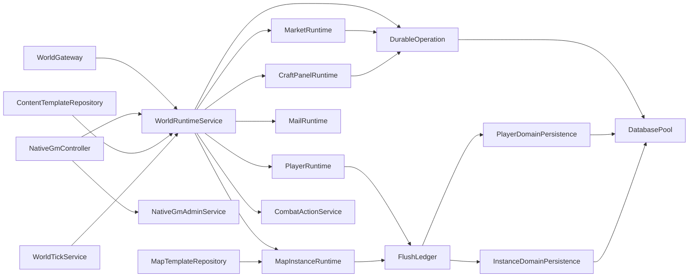
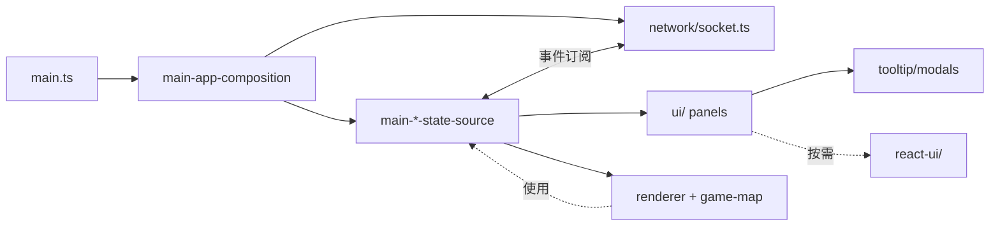
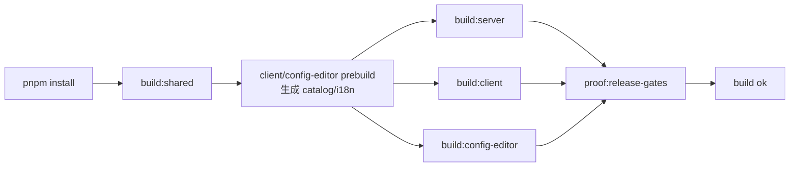

# Dependencies

外部与内部依赖清单。版本以 `package.json` 为准（本文件不冻结具体版本号）。

## 外部运行时依赖

### Server（`packages/server/package.json`）

| 包 | 用途 |
|----|------|
| `@nestjs/core` / `@nestjs/common` | IoC 容器、装饰器、模块系统 |
| `@nestjs/platform-express` | HTTP 入口（controller 路由） |
| `@nestjs/platform-socket.io` / `@nestjs/websockets` | WebSocket 网关 |
| `@nestjs/config` | 环境变量管理 |
| `socket.io` | WebSocket 服务端 |
| `socket.io-client` | 内部测试 / 压测用（smoke 里连接自身） |
| `pg` | PostgreSQL 驱动（真源持久化） |
| `bcryptjs` | 密码哈希 |
| `reflect-metadata` | NestJS 依赖 |
| `rxjs` | NestJS 依赖 |
| `@mud/shared` | 工作区内 shared |

**devDependencies**：`@nestjs/cli`、`typescript`、`@types/node`、`@types/pg`。

**未在 `dependencies` 中出现但运行期使用的能力**：

- Redis：URL 由 `SERVER_REDIS_URL` 注入，客户端按需引导（AGENTS.md 与运维文档将 Redis 列为在线态真源，具体客户端实现分布在 persistence / runtime 内部，如需定位可从 `SERVER_REDIS_URL` 环境变量使用处反查）。

### Client（`packages/client/package.json`）

| 包 | 用途 |
|----|------|
| `socket.io-client` | 与服务端 WebSocket 连接 |
| `react` / `react-dom` | 渐进式 React UI（`react-ui/`） |
| `@mud/shared` | `link:../shared` |

**devDependencies**：`vite`、`typescript`、`@types/react*`。

客户端不引入 Canvas 库，直接使用浏览器 Canvas 2D API。

### Shared（`packages/shared/package.json`）

| 包 | 用途 |
|----|------|
| `protobufjs` | Tick / Delta 二进制编解码 |

无运行时第三方状态依赖；纯类型 + 纯函数 + 常量 + 编解码 schema。

### Config Editor（`packages/config-editor/package.json`）

| 包 | 用途 |
|----|------|
| `@mud/shared` | `link:../shared` |

**devDependencies**：`vite`、`typescript`。本地 API (`local-api.cjs`) 只用 Node 内置模块（`http`、`fs`、`path`、`child_process`）。

### 根（`package.json`）

根只保留脚本，没有运行时依赖。

**devDependencies**：`typescript-language-server`、`vscode-langservers-extracted`、`yaml-language-server`（开发环境 LSP 工具）。

## 基础设施依赖

| 类别 | 选型 |
|------|------|
| 数据库 | PostgreSQL 16 |
| 缓存 / 在线态 | Redis 7 |
| 反代 / 静态资源 | Nginx（client 镜像内） |
| 容器编排 | Docker Swarm（`docker-stack.yml` / `docker-stack.tencent.yml`） |
| 镜像仓库 | 腾讯云 CCR（`ccr.ccs.tencentyun.com`）或 GHCR |
| CI | GitHub Actions（`.github/workflows/deploy.yml` 等） |
| Node 版本 | `>=18`（根 `engines.node`） |
| 包管理器 | `pnpm@10.29.1` |

## 内部包依赖图

```mermaid
graph LR
  SH[@mud/shared]
  SV[@mud/server]
  CL[@mud/client]
  CE[@mud/config-editor]
  DATA[(packages/server/data/<br/> JSON 内容源)]

  SV -->|workspace:*| SH
  CL -->|link:../shared| SH
  CE -->|link:../shared| SH

  SV -.启动期读.-> DATA
  CE -.读写.-> DATA
  CL -.构建期生成 catalog.-> CLCAT[client/src/content/]
```

约束：

- `@mud/shared` 必须先构建（`pnpm build:shared`）才能被其他包消费。
- Client / Config Editor 的 `prebuild` 脚本都会先调 `pnpm --dir ../shared build`。
- 禁止反向依赖：`shared` 不能 import `server` / `client` / `config-editor` 的任何内容。

## 包内部依赖热点

### Server 内部依赖流



### Client 内部依赖流



## 脚本依赖（`scripts/`）

根 `scripts/` 下工具使用 `node` 直接运行（CJS/MJS），不需要额外 devDep：

- 构建驱动：`verify-*.js`、`release-*.js`、`check-release-gates.js`、`check-file-size-gate.js`
- Proof：`prove-client-s2c-consumption.js`、`prove-shared-types-source.js`、`prove-protobuf-drift.js`、`prove-protocol-source.js`、`prove-server-runtime-boundaries.js`
- 内容生成：`generate-editor-catalog.mjs`、`sync-tutorial-mechanics.mjs`、`organize-techniques.mjs`、`sync-qi-item-sources.mjs`、`sync-technique-books.mjs`、`check-item-sources.mjs`、`report-alchemy-material-power.mjs`、`generate-realm-baseline-attrs.mjs`

## 外部服务依赖

| 服务 | 引入 | 代码位置 |
|------|------|----------|
| PostgreSQL | `pg.Pool` | `persistence/database-pool.provider.ts` |
| Redis | Runtime 在线态 / Session Fence / 缓存 | 配置通过 `SERVER_REDIS_URL`；具体客户端引导在 persistence / runtime 内部 |
| 爱发电（afdian）回调 | 订单同步 / webhook | `http/native/native-gm-admin.service.ts` |
| GM 外部备份存储 | 文件系统 / GCS 预留 | `native-gm-admin.service.ts` 中的 backup 相关方法 |

## 构建时依赖关系（拓扑序）



## 版本策略

- 所有工作区包 `version: 0.0.1, private: true`，不发布到 npm。
- 外部包使用 caret 范围（`^x.y.z`），变更需要走验证门禁后合并；AGENTS.md §18 规定 shared / protocol 改动至少跑 `build:shared + audit:protocol`，持久化改动至少跑 `verify:release:with-db`。
