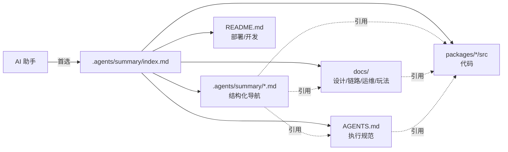

# 道劫余生 — .agents/summary/ 知识库索引

本文件是 AI 助手阅读本仓库的**主要入口**。建议把它作为首选 context，按需再读其他条目。

## 使用说明（给 AI 助手）

1. **默认先读本文件**。它包含所有子文档的定位和适用场景。
2. **按问题类型选择子文档**，不要全部一次性加载，尤其不要复制内容到答复里。
3. **协议 / 类型真源是 `@mud/shared`**。遇到协议、类型、常量问题先查 `packages/shared/src/`。
4. **Agent 执行规范在仓库根的 `AGENTS.md`**。所有落地操作必须遵循它（22 个章节），包括验证门禁选择。
5. **业务细节在 `docs/`**，尤其是 `docs/architecture/`、`docs/chains/`、`docs/runbook/`、`docs/design/`、`docs/config/`、`docs/content/`、`docs/plans/`。
6. **`.agents/summary/` 只做结构化导航**，不复刻 `docs/` 内容，也不定格过期数字。
7. **发现冲突时**：以代码为准 → 以 `docs/architecture` ADR 为设计意图参考 → 以本索引为导航辅助。

## 项目一句话

道劫余生是一个 **Web MMO MUD / 格子地图 / 类 CDDA / 挂机修仙**，采用 NestJS + Socket.IO 服务端权威、Vite + Canvas 客户端、pnpm workspace（`packages/client`、`packages/shared`、`packages/server`、`packages/config-editor`）。

## 子文档目录

| 文件 | 一句话概述 | 什么时候读 |
|------|------------|-----------|
| [`codebase_info.md`](./codebase_info.md) | 项目身份、技术栈、顶层目录、包入口、运行时口径 | 刚接触仓库；需要定位某个包 / 主入口 / 工作区配置 |
| [`architecture.md`](./architecture.md) | 分层架构、tick / 网络 / 持久化拓扑、命令管线、设计模式清单 | 问"整体怎么运作"；设计类改动前；需要理解 Facade / Pipeline / Projector 分层 |
| [`components.md`](./components.md) | 主要组件与职责表（server/client/shared/config-editor 全覆盖） | 问"XX 功能在哪个文件 / 哪个服务"；写代码前要定位 |
| [`interfaces.md`](./interfaces.md) | Socket.IO C2S / S2C 事件、HTTP 路由、鉴权、Config Editor API、验证脚本 | 问"这个事件叫什么 / 这个 API 是什么 / 协议归谁"；协议变更前 |
| [`data_models.md`](./data_models.md) | Shared 类型清单、PostgreSQL 分域表、Runtime 内存结构、内容 JSON 真源 | 问"这个字段 / 这个表 / 这份 JSON 在哪"；数据模型改动前 |
| [`workflows.md`](./workflows.md) | 12 个核心工作流时序图（登录 / tick / 战斗 / 炼丹 / 市场 / 持久化 / 重连 / 实例迁移 / 内容 / 验证 / 部署） | 问"这个流程怎么走 / 这个动作触发什么"；跨组件改动前 |
| [`dependencies.md`](./dependencies.md) | 外部包、基础设施、内部工作区依赖图、构建拓扑 | 问"用了什么库 / 升级依赖 / 包之间怎么互相依赖" |
| [`review_notes.md`](./review_notes.md) | 本次生成的一致性检查、完整性评估、遗留风险（旧 / 新持久化并存等） | 修改本套文档时；判断某段描述是否可信 |

## 按问题类型速查

### 架构 / 设计类

- "这个项目是什么架构" → `codebase_info.md` + `architecture.md`
- "为什么这样设计" → `docs/architecture/` ADR（`0001-server-authority.md` / `0002-tick-model.md` 等）
- "模块怎么拆" → `docs/architecture/service-split-conventions.md` + `components.md`

### 代码定位类

- "XX 功能在哪" → `components.md`
- "这个类型 / 常量 / 事件在哪" → `data_models.md` + `interfaces.md`（真源是 `@mud/shared`）
- "这个 HTTP 路由归谁" → `interfaces.md` HTTP 小节
- "这个 tool / smoke / worker 入口是什么" → `interfaces.md` 测试 / 验证小节 + `packages/server/package.json`

### 流程 / 链路类

- "战斗 / 交易 / 持久化 / 登录怎么走" → `workflows.md` + `docs/chains/`
- "tick 一次到底做什么" → `workflows.md` §2 + `architecture.md` tick 小节 + `docs/architecture/0002-tick-model.md`
- "断线重连" → `workflows.md` §8 + `docs/architecture/0007-reconnection.md`
- "实例迁移 / 多节点" → `workflows.md` §9 + `runtime/world/world-runtime-lifecycle.service.ts`

### 数据 / 持久化类

- "这个数据落在哪个表" → `data_models.md` PostgreSQL 分域小节
- "什么时候落盘 / 谁来落盘" → `workflows.md` §7 + `docs/chains/持久化链路.md` + `docs/architecture/持久化设计.md`
- "Durable Operation 管什么" → `interfaces.md` Durable Operation 小节 + `persistence/durable-operation.service.ts`

### 协议 / 前后端联动

- "新增协议事件要改哪些地方" → `interfaces.md` Socket.IO 小节 + AGENTS.md §7 + `shared/src/protocol*.ts` + 服务端 `WorldGateway.handle*` + 客户端 `socket-send-*.ts` + `socket-server-events.ts` + `main-*-state-source.ts`
- "协议审计 / 验证" → `interfaces.md` 测试 / 验证小节 + `pnpm audit:protocol`

### 内容 / 配置类

- "怎么加怪物 / 物品 / 技能 / 地图" → `docs/content/` + `components.md` config-editor 小节
- "编辑器在哪" → `packages/config-editor/` + `interfaces.md` Config Editor 本地 API
- "内容从哪加载" → `data_models.md` 内容模板小节

### 运维 / 部署类

- "怎么部署" → `docs/runbook/deployment.md` + `docs/deploy-tencent-ccr.md` + `workflows.md` §12
- "出问题怎么排查" → `docs/runbook/incident-response.md` + 其他 `docs/runbook/*-system.md`
- "环境变量" → `docs/config/server-env.md`
- "怎么验证" → `packages/server/TESTING.md` + AGENTS.md §18 + `interfaces.md` 验证 / 测试小节

### 玩法 / 数值类

- "这个系统怎么设计" → `docs/design/systems/`
- "数值怎么算" → `docs/design/balance/` + `shared/src/numeric.ts` + `runtime/player/player-attributes.service.ts`
- "修仙体系" → `docs/glossary.md`

### 任务 / 改动前

- "应该改哪个包" → AGENTS.md §3、§5-7、§17 + 本索引"代码定位类"
- "验证该跑什么" → AGENTS.md §18 + `packages/server/TESTING.md`
- "是否影响商业级 MMO" → AGENTS.md §4 + §8-12

## 与项目其他文档的关系

- **AGENTS.md**（仓库根）：Agent 执行规范（22 章），决定"怎么动手"。任何落地动作前必须符合。
- **`.agents/summary/`**（本目录）：给 agent 快速定位代码用的结构化导航。
- **`docs/`**：给人类开发者用的设计 / 链路 / 运维 / 玩法文档。agent 在深入一个子系统时按需读。
- **`README.md`**：项目介绍、部署、本地开发。

## 示例查询

- **"道劫余生是什么项目"** → 读 `codebase_info.md`（项目身份小节）。
- **"玩家升级的代码在哪"** → 读 `components.md` player/ 小节 → 定位 `packages/server/src/runtime/player/player-progression.service.ts`；如需数值规则，再读 `docs/design/balance/` 和 `docs/design/systems/境界突破要求.md`。
- **"市场下单走什么流程"** → 读 `workflows.md` §6 + `components.md` market/ 小节 + `docs/chains/交易链路.md`。
- **"我要加一个新的客户端 → 服务端事件，要改哪些文件"** → `interfaces.md` Socket.IO 小节 + AGENTS.md §7 + `workflows.md` §3。
- **"这次改动要跑哪些验证"** → AGENTS.md §18 + `packages/server/TESTING.md` + `interfaces.md` 测试 / 验证小节。
- **"协议审计是什么"** → `interfaces.md` 测试 / 验证小节 → `pnpm audit:protocol` → `packages/server/src/tools/protocol-audit.ts` + `protocol-audit-lib.ts`。
- **"玩家数据怎么落库"** → `workflows.md` §7 + `data_models.md` PostgreSQL 分域小节 + `docs/chains/持久化链路.md`。
- **"这个项目怎么部署到腾讯云"** → `README.md` + `docs/deploy-tencent-ccr.md` + `workflows.md` §12 + `docs/runbook/deployment.md`。

## 维护提示

- 本目录所有文档**可安全重新生成**。若要执行 codebase-summary 更新，不会影响 `AGENTS.md`（根据本次约定，不覆盖）。
- 发现事实漂移（例如协议事件列表变更、新增 runtime service）时，优先更新对应子文档；`index.md` 只在新增 / 删除子文档时需要改。
- 业务数值 / 字段 / 行号不要复制到 summary：容易过期、伤害 agent 信任度。
- 遇到与 `docs/` 冲突的描述：如果是事实性差异，更新 summary；如果是侧重点不同，两边保留各自视角。
