# Workflows

关键业务流程和跨组件时序图。详细链路文档见 `docs/chains/`。

## 1. 玩家登录与首包

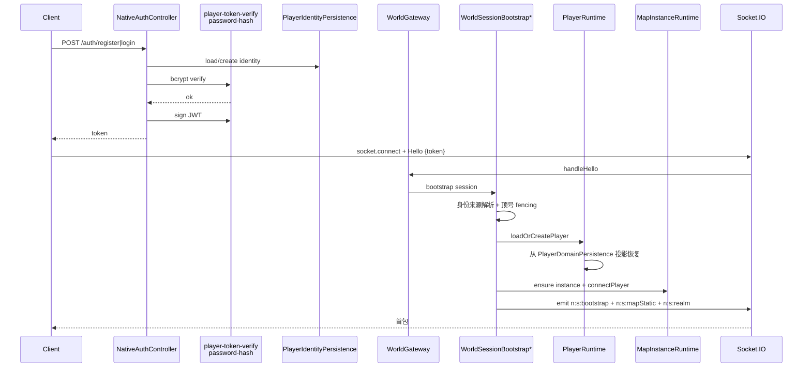

参考：`docs/chains/登录链路.md`、`docs/architecture/0007-reconnection.md`、`network/world-session-bootstrap*.service.ts`。

## 2. 每息 tick 推进

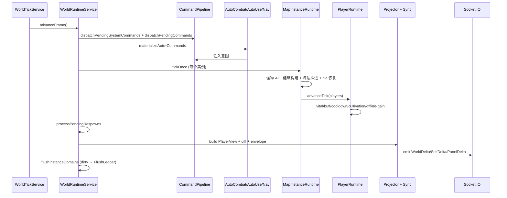

## 3. 玩家操作意图（移动 / 技能 / 物品 / 交易）

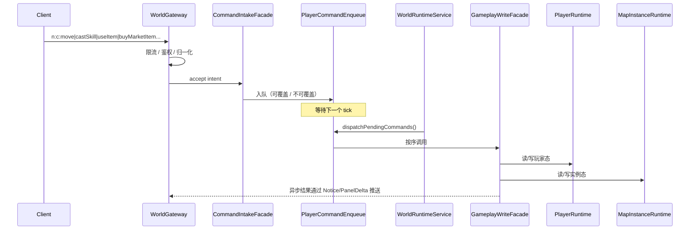

- 可覆盖意图（移动 / 寻路目标）：同 tick 最后一次生效。
- 不可覆盖意图（交易 / 炼丹启动 / 兑换码）：排队 + 幂等 + 拒绝规则。

## 4. 战斗链路（玩家施法）

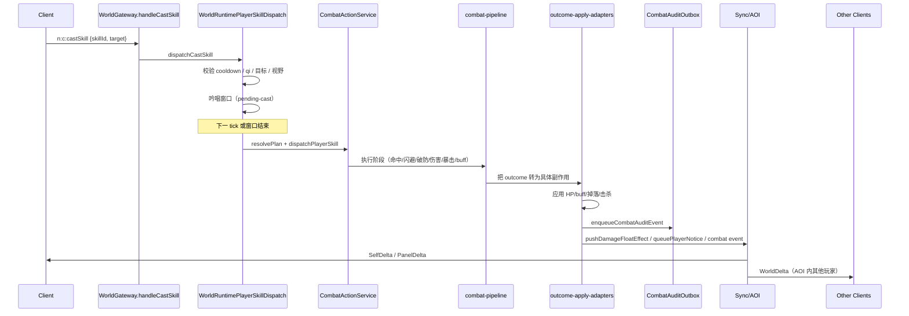

参考：`docs/chains/战斗链路.md`、`docs/architecture/ADR-战斗链路统一分层与过渡迁移.md`、`runtime/combat/` + `runtime/world/combat/`。

## 5. 炼丹 / 强化（Active Job）

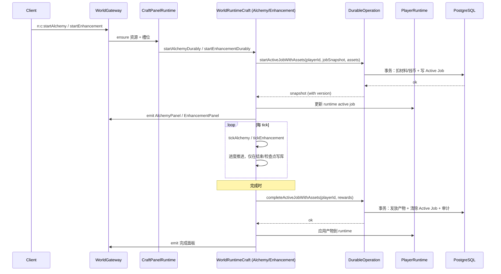

Durable Op 保证：跨节点 lease、幂等 version、失败回滚、审计记录。

## 6. 市场交易（挂单 / 撮合 / 拍卖）

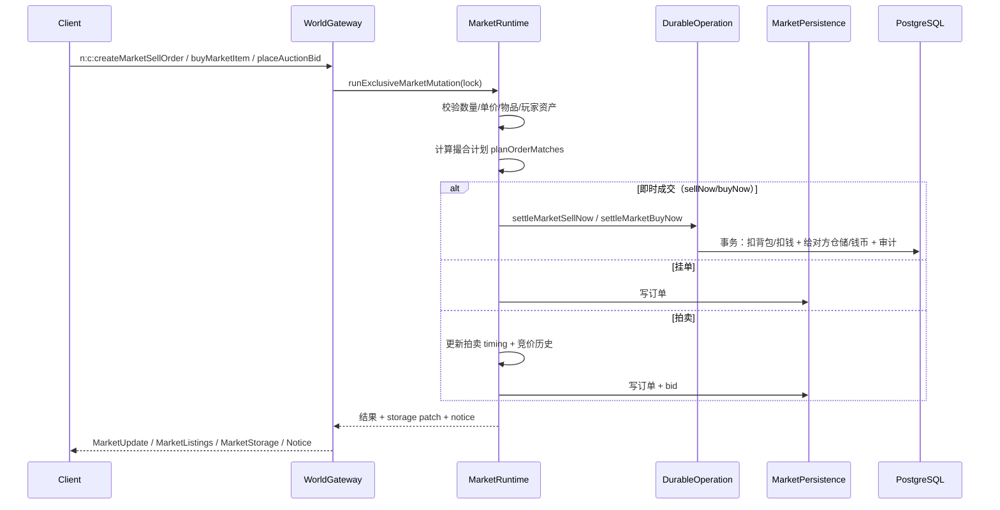

参考：`docs/chains/交易链路.md`、`runtime/market/market-runtime.service.ts`、`persistence/market-persistence.service.ts`、`persistence/durable-operation.service.ts`。

## 7. 持久化刷盘（分域）

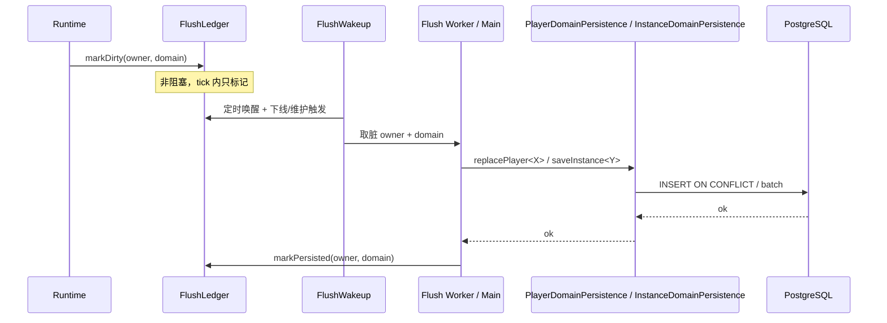

Worker 既可作为主进程内服务（`player-persistence-flush.service.ts` 等），也可作为独立进程（`tools/*-flush-worker.ts`，由 `packages/server/package.json` 的 `instance:*-worker` / `player:*-worker` / `mail:*-worker` 等启动）。

## 8. 断线重连

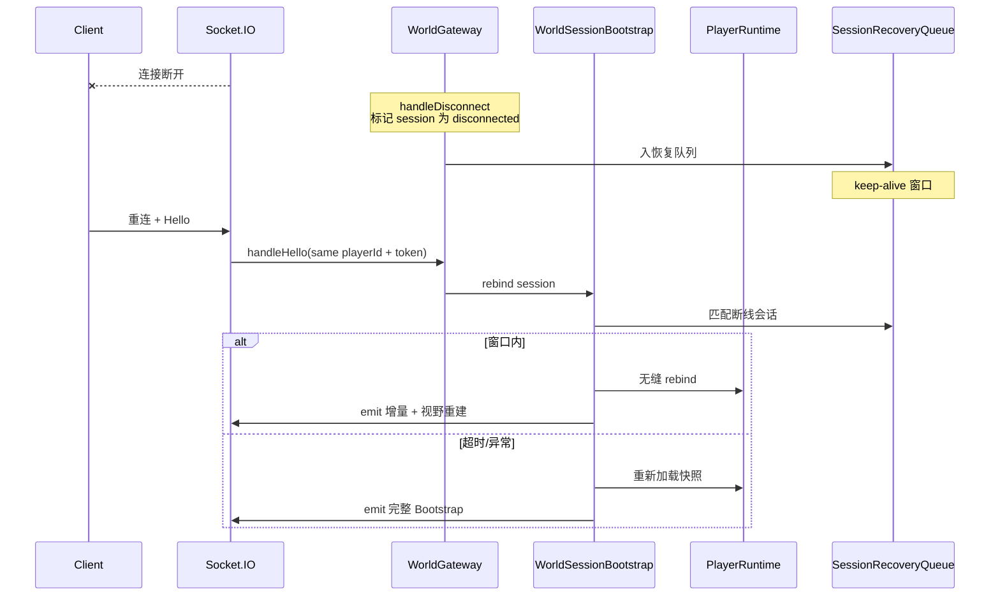

参考：`docs/architecture/0007-reconnection.md`、`network/world-session-recovery-queue.service.ts`、`world-session-reaper.service.ts`。

## 9. 地图实例迁移（跨节点）

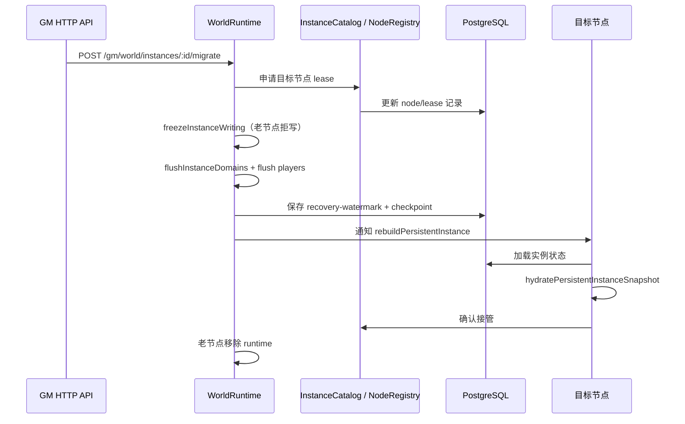

## 10. 内容发布与热更

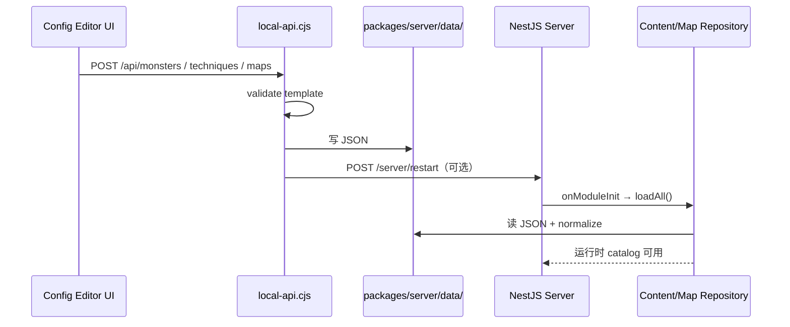

客户端 catalog 是构建期生成，不支持真正的热更；修改后需要重建前端或调用生成脚本。

## 11. 验证与发布链

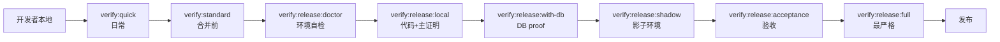

五层 gate 含义见 `packages/server/TESTING.md` 和 AGENTS.md §18；不可互相替代。

## 12. 部署（腾讯云 CCR + Docker Swarm）

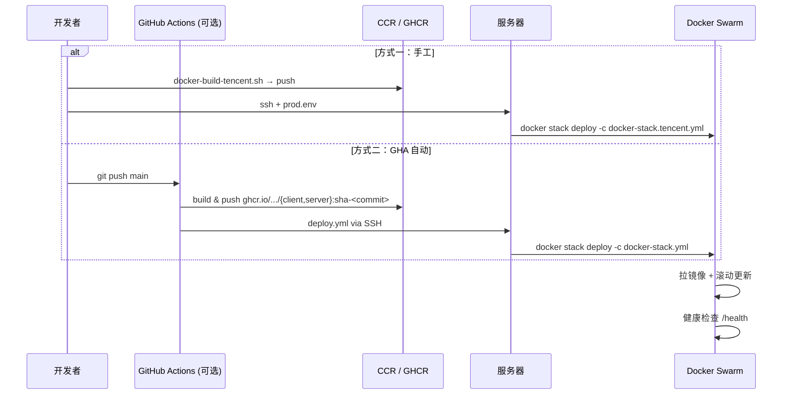

参考：`README.md`、`docs/deploy-tencent-ccr.md`、`docs/runbook/deployment.md`。

## 相关文档

- `docs/chains/链路总览.md`（最全链路）
- `docs/chains/战斗链路.md` / `登录链路.md` / `交易链路.md` / `持久化链路.md`
- `docs/runbook/deployment.md` / `incident-response.md` / `战斗链路运维手册.md` / `mail-system.md` / `market-system.md` / `gm-system.md`
- `docs/architecture/0002-tick-model.md` / `0005-aoi-system.md` / `0006-map-instance.md` / `0007-reconnection.md`
