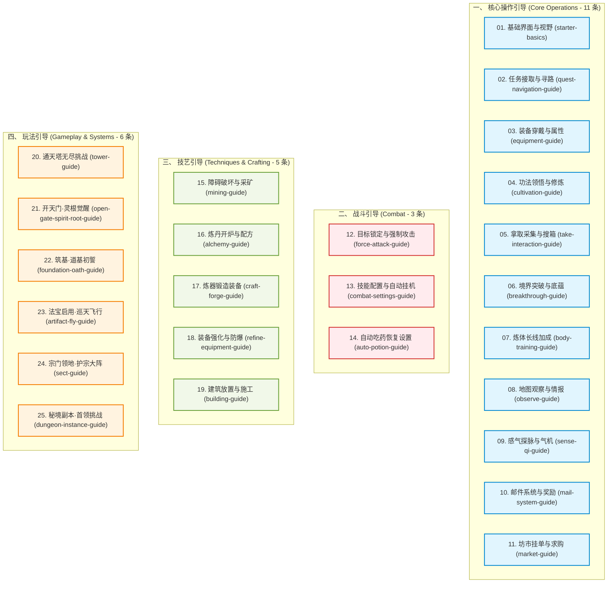

# 任务系统与全操作引导体系规划分析

> 本文档针对《道劫余生》全主线任务与操作引导体系进行系统性梳理与重构规划。
> 
> **分类口径**：
> - **核心操作**：玩家日常基础与通用系统交互（界面视野、寻路交接、穿戴装备、功法修炼、拿取采集搜箱、突破、炼体、观察、感气、邮件、坊市）。
> - **战斗引导**：目标锁定攻击、技能管理与自动施法、自动吃药保命配置。
> - **技艺引导**：破障采矿、炼丹制药、炼器锻造、装备强化防爆、建筑建造。
> - **玩法引导**：通天塔副本、开天门觉醒灵根、筑基道基初誓、法宝巡天御空、宗门领地与护宗大阵、后续秘境副本。
> 
> **机制澄清**：
> - 战斗击败怪物的战利品（灵石、掉落物）**自动进入背包**。
> - 行动栏中的「拿取」行动（`client:take`）专门用于**采集野外药草、搜索野外容器（箱子/宝箱/储物袋）、拿取地表掉落物**。

---

## 一、 引导体系 4 大分类架构

引导体系共划分为 **4 大分类，共计 25 条专项引导流（Guided Tour Flows）**：

---

## 二、 4 大分类详细引导清单

### 1. 核心操作引导 (Core Operations - 11 条)
*负责最基础、最通用的日常行为与系统交互。*

| 序号 | 引导流 ID (`flowId`) | 引导主题 | 教学核心交互步骤 | 挂接主线/支线任务示例 |
| :---: | :--- | :--- | :--- | :--- |
| **01** | `starter-basics` | **基础界面与视野** | 顶部 HUD 自身状态 $\rightarrow$ 地图主行动区 $\rightarrow$ 任务标记(`!`可接/`?`可交/`...`进行) $\rightarrow$ 行囊 $\rightarrow$ 行动栏 $\rightarrow$ 百科 | 序章 Q1《初入云来镇》 |
| **02** | `quest-navigation-guide` | **任务接取与寻路** | 任务追踪栏 $\rightarrow$ 点击「前往目标/前往交付」 $\rightarrow$ 自动跨图寻路 $\rightarrow$ 靠近 NPC 弹出交互 | 序章 Q1《初入云来镇》 |
| **03** | `equipment-guide` | **装备穿戴与属性** | 打开行囊 $\rightarrow$ 切换装备页 $\rightarrow$ 选中装备 $\rightarrow$ 点击「穿戴」 $\rightarrow$ 查看六维属性提升 | 序章 Q2《整备行装》 |
| **04** | `cultivation-guide` | **功法领悟与修炼** | 行囊功法页 $\rightarrow$ 学习秘籍 $\rightarrow$ 设为主修功法 $\rightarrow$ 行动栏开关页 $\rightarrow$ 开启闭关修炼 $\rightarrow$ 自动空闲修炼 | 序章 Q3《授诀护此身》 |
| **05** | `take-interaction-guide` | **拿取采集与搜箱** | 行动栏通用页「拿取」 $\rightarrow$ 地图点击药草/宝箱/地面掉落物 $\rightarrow$ 采集药草或搜刮容器一键入包 | 序章 Q5《打扫战场》 |
| **06** | `breakthrough-guide` | **境界突破与底蕴** | 修为满 $\rightarrow$ 观察 HUD 突破按钮 $\rightarrow$ 打开突破弹窗查看突破材料与底蕴加成 $\rightarrow$ 确认突破升阶 | 序章 Q6《炼皮立根基》 |
| **07** | `body-training-guide` | **炼体长线加成** | 打开炼体面板 $\rightarrow$ 查看六维百分比加成规则 $\rightarrow$ 注入多余修为/药材提升炼体层数 | 第一章 Q5《气血铸体》 |
| **08** | `observe-guide` | **地图观察与情报** | 行动栏通用页 $\rightarrow$ 点击「观察」 $\rightarrow$ 地图选格查看地块耐久、怪物属性、建筑信息 | 第一章 Q3《探查灵泉》 |
| **09** | `sense-qi-guide` | **感气探脉与气机** | 行动栏开关页 $\rightarrow$ 开启「感气」 $\rightarrow$ 观察地图灵气、魔气、煞气浓度分布与灵脉地标 | 第一章 Q4《凝神辨气》 |
| **10** | `mail-system-guide` | **邮件系统与奖励** | 顶部入口打开邮件 $\rightarrow$ 查看系统通知/掉落邮件 $\rightarrow$ 一键领取附件道具与灵石 | 第三章 Q3《驿馆来鸿》 |
| **11** | `market-guide` | **坊市挂单与求购** | 顶部/行动栏打开坊市 $\rightarrow$ 市场挂单出售 $\rightarrow$ 求购单机制 $\rightarrow$ 灵石结算与自动撮合规则 | 第二章 Q3《坊市通商》 |

---

### 2. 战斗引导 (Combat - 3 条)
*负责打怪与挂机全流程：锁定攻击、技能管理与自动挂机、自动用药保命。*

| 序号 | 引导流 ID (`flowId`) | 引导主题 | 教学核心交互步骤 | 挂接主线任务 |
| :---: | :--- | :--- | :--- | :--- |
| **12** | `force-attack-guide` | **目标锁定与强制攻击** | 行动栏通用页 $\rightarrow$ 点击「强制攻击」进入选目标态 $\rightarrow$ 地图选怪攻击 $\rightarrow$ 普攻与技能施放 | 序章 Q4《南门驱鼠患》 |
| **13** | `combat-settings-guide` | **技能配置与挂机** | 技能管理页 $\rightarrow$ 配置自动施法开关与顺序 $\rightarrow$ 开启自动战斗/反击 $\rightarrow$ 设置索敌偏好 | 第一章 Q1《荒野备战》 |
| **14** | `auto-potion-guide` | **自动吃药恢复** | 战斗设置页 $\rightarrow$ 配置气血/灵力回复药槽 $\rightarrow$ 设定自动触发百分比阈值 | 第一章 Q2《止血备药》 |

---

### 3. 技艺引导 (Techniques & Crafting - 5 条)
*负责资源采集、加工制造、装备强化与土木建造。*

| 序号 | 引导流 ID (`flowId`) | 引导主题 | 教学核心交互步骤 | 挂接主线任务 |
| :---: | :--- | :--- | :--- | :--- |
| **15** | `mining-guide` | **障碍破坏与采矿** | 强制攻击击碎挡路石 $\rightarrow$ 靠近玄铁矿脉 $\rightarrow$ 技能页点击「采矿」 $\rightarrow$ 地图选矿脉采集 | 第三章 Q1《矿洞破障》 |
| **16** | `alchemy-guide` | **炼丹开炉与配方** | 左侧技艺 $\rightarrow$ 打开炼丹台 $\rightarrow$ 凡胎回复药分类 $\rightarrow$ 选定回春散 $\rightarrow$ 投料五行匹配 $\rightarrow$ 开始炼制 | 第二章 Q1《炉前试手》 |
| **17** | `craft-forge-guide` | **炼器锻造装备** | 技艺面板 $\rightarrow$ 炼器台 $\rightarrow$ 选择武器/防具图谱 $\rightarrow$ 投入矿石配比五行 $\rightarrow$ 打造装备 | 第三章 Q2《淬火砺兵》 |
| **18** | `refine-equipment-guide`| **装备强化与防爆** | 技艺面板 $\rightarrow$ 强化台 $\rightarrow$ 放入装备与强化石 $\rightarrow$ 成功率衰减与保护材料说明 $\rightarrow$ 开始强化 | 第二章 Q2《百炼成钢》 |
| **19** | `building-guide` | **建筑放置与施工** | 技艺面板 $\rightarrow$ 建造台 $\rightarrow$ 选择地块结构（墙/门/地板/设施） $\rightarrow$ 地图放置半成品 $\rightarrow$ 1格内施工推进 | 支线/宗门任务 |

---

### 4. 玩法引导 (Gameplay & Systems - 6 条)
*负责特色副本、境界质变（开天门/筑基初誓）、法宝御空、宗门领地与后续秘境。*

| 序号 | 引导流 ID (`flowId`) | 引导主题 | 教学核心交互步骤 | 挂接主线任务 |
| :---: | :--- | :--- | :--- | :--- |
| **20** | `tower-guide` | **通天塔副本挑战** | 栖真渡入口传送 $\rightarrow$ 副本层数规则 $\rightarrow$ 怪物波次清理 $\rightarrow$ 拾取通关宝箱 $\rightarrow$ 进度存档与重连 | 第四章 Q1《通天试炼》 |
| **21** | `open-gate-spirit-root-guide`| **开天门·灵根觉醒**| 先天圆满叩开天门 $\rightarrow$ 觉醒五行灵根 $\rightarrow$ 查看五行伤害/减免与灵气吸收效率 | 第四章 Q6《练气叩天门》 |
| **22** | `foundation-oath-guide` | **筑基·道基初誓** | 服筑基丹初誓 $\rightarrow$ 筑基期根基定型 $\rightarrow$ 大道誓言与道基底蕴加成 | 终章 Q1《道基初誓》 |
| **23** | `artifact-fly-guide` | **法宝启用·巡天飞行** | 行囊佩戴法宝 $\rightarrow$ 启用开启法宝 $\rightarrow$ 法宝每息灵力消耗与盈能机制 $\rightarrow$ 巡天飞剑无视静态障碍穿行 | 第五章 Q1《御器凌空》 |
| **24** | `sect-guide` | **宗门领地·护宗大阵** | 宗门面板 $\rightarrow$ 宗门列表申请/创建 $\rightarrow$ 领地击败扩展 $\rightarrow$ 护宗大阵灵力维护与防御控制 | 终章 支线《开山立派》 |
| **25** | `dungeon-instance-guide` | **秘境副本·首领挑战** | 秘境传送入口 $\rightarrow$ 副本机关与词缀 $\rightarrow$ Boss 阶段破招与仇恨机制 $\rightarrow$ 首通结算 | 后续进阶副本 |

---

## 三、 主线任务 7 卷与引导全景映射表

### 1. 序章·断道入镇（凡俗 Lv.1 $\rightarrow$ 炼皮 Lv.2）
| 任务 ID | 任务标题 | 目标类型 | 引导分类 | 挂接引导 Flow | 教学目的 |
| :--- | :--- | :--- | :--- | :--- | :--- |
| `q_intro_south_gate_rollcall` | 初入云来镇 | `talk` | **核心操作** | `starter-basics` + `quest-navigation-guide` | 认识界面与一键寻路 |
| `q_intro_old_road_witness` | 整备行装 | `talk`/`equip` | **核心操作** | `equipment-guide` | 穿戴防具、看属性变化 |
| `q_intro_manual` | 授诀护此身 | `learn_technique` | **核心操作** | `cultivation-guide` | 学习功法、设主修、开闭关修炼 |
| `q_intro_clear_south_gate` | 南门驱鼠患 | `kill` | **战斗引导** | `force-attack-guide` | 强制攻击与打怪 |
| `q_intro_medicine_fee` | 打扫战场 | `kill` + `item` | **核心操作** | `take-interaction-guide` | 拿取行动搜刮容器与采集 |
| `q_intro_body_tempering` | 炼皮立根基 | `realm_stage` | **核心操作** | `breakthrough-guide` | 攒满修为突破凡人第1境界 |

---

### 2. 第一章·云来初境（炼皮 Lv.2 $\rightarrow$ 锻骨 Lv.6）
| 任务 ID | 任务标题 | 目标类型 | 引导分类 | 挂接引导 Flow | 教学目的 |
| :--- | :--- | :--- | :--- | :--- | :--- |
| `q_wildlands_roadhouse` | 荒野备战 | `talk` | **战斗引导** | `combat-settings-guide` | 技能配置与自动挂机 |
| `q_wildlands_boar_meat` | 止血备药 | `kill` | **战斗引导** | `auto-potion-guide` | 自动吃药槽与血线阈值 |
| `q_wildlands_swamp_medicine` | 探查灵泉 | `talk`/`observe` | **核心操作** | `observe-guide` | 观察地块、怪物与环境情报 |
| `q_wildlands_old_gate_words` | 凝神辨气 | `talk` | **核心操作** | `sense-qi-guide` | 开感气看灵气/魔气/煞气 |
| `q_wildlands_bandit_toll` | 气血铸体 | `kill` | **核心操作** | `body-training-guide` | 炼体长线百分比属性养成 |
| `q_wildlands_bone_forging` | 锻骨凝元 | `realm_stage` | **核心操作** | `breakthrough-guide` | 突破至锻骨境(Lv.6) |

---

### 3. 第二章·青竹探秘（锻骨 Lv.6 $\rightarrow$ 通脉 Lv.10）
| 任务 ID | 任务标题 | 目标类型 | 引导分类 | 挂接引导 Flow | 教学目的 |
| :--- | :--- | :--- | :--- | :--- | :--- |
| `q_bamboo_scouting` | 炉前试手 | `talk`/`craft` | **技艺引导** | `alchemy-guide` | 炼丹台五行投料与制药 |
| `q_bamboo_wolf_fangs` | 百炼成钢 | `kill`/`refine` | **技艺引导** | `refine-equipment-guide` | 强化装备与保护材料说明 |
| `q_bamboo_broken_cart` | 坊市通商 | `talk` | **核心操作** | `market-guide` | 坊市市场买卖与求购单 |
| `q_bamboo_serpent_gall` | 覆车验痕 | `kill` | - | - | 剧情推进与野外战斗 |
| `q_bamboo_hermit_path` | 竹隐问径 | `talk` | - | - | 剧情推进与功法获得 |
| `q_bamboo_meridian` | 通脉破境 | `realm_stage` | **核心操作** | `breakthrough-guide` | 突破至通脉境(Lv.10) |

---

### 4. 第三章·灵脊历险（通脉 Lv.10 $\rightarrow$ 先天 Lv.15）
| 任务 ID | 任务标题 | 目标类型 | 引导分类 | 挂接引导 Flow | 教学目的 |
| :--- | :--- | :--- | :--- | :--- | :--- |
| `q_mine_signal_talk` | 矿洞破障 | `talk` | **技艺引导** | `mining-guide` | 破障与采矿采集 |
| `q_mine_signal_core` | 淬火砺兵 | `kill`/`craft` | **技艺引导** | `craft-forge-guide` | 炼器锻造装备 |
| `q_ruin_keeper_talk` | 驿馆来鸿 | `talk` | **核心操作** | `mail-system-guide` | 邮件系统与附件领取 |
| `q_ruin_keystone_main` | 钥石出幽门 | `kill` | - | - | 副本探索与钥石搜寻 |
| `q_ruin_shard_trace` | 旧纹散成片 | `submit_item` | - | - | 阵纹收集 |
| `q_ruin_innate` | 先天叩关 | `realm_stage` | **核心操作** | `breakthrough-guide` | 突破至先天境(Lv.15) |

---

### 5. 第四章·深渊试炼（先天 Lv.15 $\rightarrow$ 练气 Lv.19 开天门）
| 任务 ID | 任务标题 | 目标类型 | 引导分类 | 挂接引导 Flow | 教学目的 |
| :--- | :--- | :--- | :--- | :--- | :--- |
| `q_valley_patrol_talk` | 通天试炼 | `talk` | **玩法引导** | `tower-guide` | 栖真渡通天塔无尽挑战 |
| `q_valley_core_main` | 兽谷取核心 | `kill` | - | - | 兽谷精英怪挑战 |
| `q_valley_blood_feather_main` | 清谷收血羽 | `kill` | - | - | 收集材料 |
| `q_ridge_sage_talk` | 守岭问旧事 | `talk` | - | - | 探寻天门奥秘 |
| `q_ridge_sigil_main` | 夺取灵岭令 | `kill` | - | - | 夺取通行令牌 |
| `q_ridge_qi_refining` | 练气叩天门 | `realm_stage` | **玩法引导** | `open-gate-spirit-root-guide` | 凡人圆满，叩开天门觉醒灵根 |

---

### 6. 第五章·天穹之战（练气期深入）
| 任务 ID | 任务标题 | 目标类型 | 引导分类 | 挂接引导 Flow | 教学目的 |
| :--- | :--- | :--- | :--- | :--- | :--- |
| `q_sky_observer_talk` | 御器凌空 | `talk` | **玩法引导** | `artifact-fly-guide` | 佩戴法宝、盈能与巡天飞行 |
| `q_sky_star_metal_main` | 夺回星陨金 | `kill` | - | - | 收集高阶矿物 |
| `q_sky_seal_core_main` | 取天封核心 | `kill` | - | - | 破除阵法核心 |

---

### 7. 终章·道劫余生（筑基期初誓）
| 任务 ID | 任务标题 | 目标类型 | 引导分类 | 挂接引导 Flow | 教学目的 |
| :--- | :--- | :--- | :--- | :--- | :--- |
| `q_foundation_oath` | 道基初誓 | `realm_stage` | **玩法引导** | `foundation-oath-guide` + `sect-guide` | 筑基道基初誓，开启宗门与高阶玩法 |

